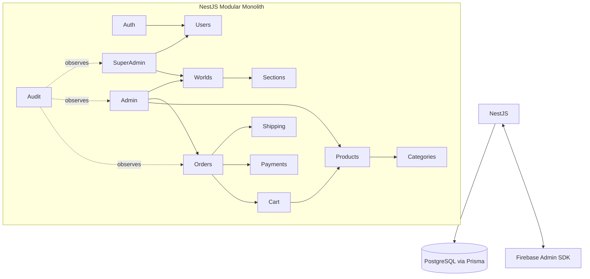

# Yourverse — Backend Architecture

## 1. Architecture Overview

A single NestJS Modular Monolith backed by PostgreSQL/Prisma, exposing one versioned REST API (`/api/v1`) consumed by the one Next.js frontend (store, admin, super-admin, shipping). Firebase Authentication handles credential verification; NestJS owns sessions, roles, and permissions. Worlds and Sections are backend-owned domain data — the frontend never invents composition, it only renders what this API returns.



## 2. Why Modular Monolith

A single deployable with strict module boundaries gets Yourverse most of microservices' maintainability benefits (clear ownership, enforced boundaries via module exports) without their operational cost (service discovery, distributed transactions, network latency between Products and Orders). One developer can run and debug the entire system locally. Module boundaries are enforced by NestJS's own module/provider export rules: a module only exposes what it explicitly exports, so e.g. `OrdersModule` cannot reach into `ProductsService` internals it wasn't given. If a specific module (e.g., Payments, for PCI-scope isolation) later needs independent scaling or a separate compliance boundary, it can be extracted because its boundary was already explicit — this is deferred, not designed away.

## 3. NestJS Module Structure

```
Auth          — Firebase token verification, session cookie issuance/revocation, /auth/me
Users         — user records, role assignment (JIT provisioning on first login)
Worlds        — World CRUD, theme tokens, capabilities
Sections      — world_sections CRUD/reorder (kept separate from Worlds for clarity, exported together)
Categories    — per-World category tree
Products      — products, variants, images, inventory
Cart          — cart + cart items (guest + authenticated)
Orders        — order + order item lifecycle
Payments      — payment provider integration, payment status
Shipping      — shipments, carrier/tracking, status transitions
Admin         — admin-only aggregation endpoints (dashboards, reports) — thin, delegates to domain services
SuperAdmin    — world lifecycle (create/delete), user role management
Audit         — write-only audit log service, injected into other modules
Common        — guards, decorators, filters, pipes, interceptors (not a domain module)
```

Improvement over the initial list: **Sections split from Worlds** (composition changes far more often than World identity, and Admin vs Super Admin permissions differ between the two — Admin edits sections, only Super Admin edits World identity). **Admin/SuperAdmin are thin orchestration modules**, not where business logic lives — `products.create` logic lives in `ProductsService` regardless of whether it's called from a future public seller API or the admin UI.

## 4. Folder Structure

```
src/
  modules/
    auth/
      auth.controller.ts
      auth.service.ts
      firebase-admin.provider.ts
      strategies/session.guard.ts
    users/
    worlds/
      worlds.controller.ts
      worlds.service.ts
      sections/
        sections.controller.ts
        sections.service.ts
    products/
      products.controller.ts
      products.service.ts
      variants/
    categories/
    cart/
    orders/
    payments/
    shipping/
    admin/
    super-admin/
    audit/
  common/
    guards/
      firebase-session.guard.ts
      roles.guard.ts
      permissions.guard.ts
    decorators/
      roles.decorator.ts
      permissions.decorator.ts
      current-user.decorator.ts
    filters/
      http-exception.filter.ts
    interceptors/
      logging.interceptor.ts
      transform.interceptor.ts
    pipes/
      zod-validation.pipe.ts
  prisma/
    prisma.service.ts
    prisma.module.ts
  main.ts
```

## 5. Domain Boundaries

- **Products** knows nothing about "Anime" or "Chess" — it knows `worldId` as an opaque foreign key. World-specific *merchandising* (which products a World's `product_grid` section shows) is expressed via category/collection filters in section `config`, not via Product-level branching.
- **Worlds/Sections** knows nothing about product business rules — it stores composition and delegates any data it needs (e.g., resolving a `product_grid` section's actual products at request time) by calling `ProductsService` with parameters, never duplicating product query logic.
- **Orders** never talks to Firebase directly, and **Shipping** never talks to Payments directly — each depends only on the modules it explicitly needs, kept thin via constructor injection of narrow service interfaces.

## 6. Auth Architecture

### Firebase Authentication integration

The frontend authenticates directly against Firebase (Google/GitHub/email-password) and receives a short-lived Firebase ID token. That token is sent **once**, to `POST /api/v1/auth/session`, and never stored by the frontend.

### Firebase Admin SDK

`FirebaseAdminProvider` initializes the Admin SDK once (service account credentials from env/secret manager) and is injected into `AuthService`. Two Admin SDK capabilities are used:
- `verifyIdToken(idToken)` — validates the token presented at login.
- `createSessionCookie(idToken, { expiresIn })` / `verifySessionCookie(cookie, checkRevoked)` — Firebase's purpose-built long-lived session mechanism.

### 7-day session architecture

**Do not** store the raw ID token (it's short-lived, ~1 hour, and isn't meant for long-term storage). Instead, use Firebase's **session cookie** feature, designed exactly for this:

```mermaid
sequenceDiagram
    participant FE as Frontend
    participant Nest as NestJS /auth/session
    participant FBAdmin as Firebase Admin SDK

    FE->>Nest: POST /auth/session { idToken }
    Nest->>FBAdmin: verifyIdToken(idToken)
    FBAdmin-->>Nest: decoded token (uid, email, ...)
    Nest->>FBAdmin: createSessionCookie(idToken, { expiresIn: 7d })
    FBAdmin-->>Nest: session cookie value
    Nest->>Nest: upsert User row by firebaseUid (JIT provisioning, default role USER)
    Nest-->>FE: Set-Cookie: __session=<value>; HttpOnly; Secure; SameSite=Lax; Max-Age=604800
```

On every subsequent request, `FirebaseSessionGuard` calls `verifySessionCookie(cookie, true)` (the `true` enables revocation checking) and attaches the resulting `{ uid, email }` plus the corresponding `User` row (role, permissions) to the request. This gives Yourverse a 7-day session **without building a custom session store**, while still allowing forced logout via `revokeRefreshTokens(uid)` (e.g., on password change or admin-forced logout) — `/auth/logout` calls this and clears the cookie.

```ts
// auth/strategies/session.guard.ts
@Injectable()
export class FirebaseSessionGuard implements CanActivate {
  constructor(private auth: AuthService, private usersService: UsersService) {}
  async canActivate(ctx: ExecutionContext): Promise<boolean> {
    const req = ctx.switchToHttp().getRequest<Request>();
    const cookie = req.cookies?.["__session"];
    if (!cookie) throw new UnauthorizedException("No session");
    const decoded = await this.auth.verifySessionCookie(cookie); // wraps Admin SDK, throws on invalid/revoked
    const user = await this.usersService.findByFirebaseUid(decoded.uid);
    if (!user) throw new UnauthorizedException("User not provisioned");
    req.user = user; // { id, role, firebaseUid, email }
    return true;
  }
}
```

### Cookie strategy

- `HttpOnly` always — never readable by client JS.
- `Secure` in production (HTTPS only); relaxed only in local dev over HTTP.
- `SameSite=Lax` is the default recommendation, assuming frontend and backend share a registrable domain (e.g., `app.yourverse.com` and `api.yourverse.com`) — this is same-site for cookie purposes and Lax already permits normal top-level navigations while blocking cross-site POSTs.
- If frontend and backend must live on **fully separate domains** (no shared parent), the cookie needs `SameSite=None; Secure`, which weakens CSRF protection from SameSite alone — see §CSRF below for the added mitigation this requires. **Recommendation: deploy under a shared parent domain to avoid this entirely.**
- `Max-Age` ≈ 604800s (7 days), matching `createSessionCookie`'s `expiresIn`.

### RBAC

Initial roles: `USER`, `ADMIN`, `SUPER_ADMIN`, `SHIPPING`, stored as an enum column on `User`. JIT-provisioned on first successful `/auth/session` call, defaulting to `USER`; role changes are Super-Admin-only via `/super-admin/users/:id/role`.

### Permissions

Roles map to permissions via a **code-defined matrix** in v1 (not yet a DB table — no product need for per-user custom permissions yet, and a static matrix is simpler to reason about and audit):

```ts
// common/authz/permissions.ts
export const ROLE_PERMISSIONS: Record<Role, string[]> = {
  USER: [],
  SHIPPING: ["orders.read", "shipping.read", "shipping.update"],
  ADMIN: [
    "products.read", "products.create", "products.update", "products.delete",
    "orders.read", "orders.update",
    "shipping.read", "shipping.update",
    "worlds.read", "worlds.sections.update",
  ],
  SUPER_ADMIN: ["*"], // superset — checked first in PermissionsGuard
};
```

This is designed to evolve: swapping the matrix lookup for a DB-backed `role_permissions` table (or per-user overrides) later is a one-file change in `PermissionsGuard`, because every controller already declares permissions declaratively via `@Permissions("products.update")`, never checking roles by hand.

### Guards

Applied globally, composed per-route via decorators:

```ts
@UseGuards(FirebaseSessionGuard, PermissionsGuard)
@Permissions("products.update")
@Patch(":id")
updateProduct(@Param("id") id: string, @Body() dto: UpdateProductDto) { ... }
```

`RolesGuard` exists for the rarer case of a hard role gate (e.g., `@Roles("SUPER_ADMIN")` on World create/delete) where "permission" framing would be artificial.

## 7. Module Notes

- **Users**: `firebaseUid` (unique), `email`, `displayName`, `role`. No password storage — Firebase owns credentials entirely.
- **Worlds**: identity + theme + capabilities; `worlds.sections.update` permission distinct from `worlds.update` (identity) so Admin can reorder/configure sections without being able to rename or delete the World.
- **Products**: `worldId`, `categoryId`, price as `Decimal`, `status` enum (`DRAFT`, `ACTIVE`, `ARCHIVED`). Variants/images/inventory are child entities — a bare "Product" is never directly purchasable, a `ProductVariant` is (even single-variant products get one implicit variant, keeping Cart/Order logic uniform).
- **Cart**: supports guest carts (identified by a signed cart-id cookie, separate from the auth session cookie) merged into the user's cart on login.
- **Orders**: created from a Cart snapshot (denormalizes price/variant at time of purchase — never re-reads live product price after an order exists).
- **Payments**: provider-agnostic `PaymentProvider` interface; concrete provider (Stripe, etc.) is an adapter behind it, so switching providers doesn't touch `OrdersService`.
- **Shipping**: `Shipment` is 1:1 (or 1:many for split shipments) with `Order`, with its own status enum, intentionally decoupled from `OrderStatus` (an order can be `PAID` while its shipment is still `PROCESSING`).
- **Admin/SuperAdmin**: expose aggregation/report endpoints and permission-gated CRUD passthroughs; contain no independent business rules.
- **Audit**: `AuditLogService.record({ actorUserId, action, entityType, entityId, metadata })` called from service-layer mutations (not controllers) on every state-changing operation in Orders, Shipping, Worlds, SuperAdmin.

## 8. PostgreSQL / Prisma Architecture

One Prisma schema, domain-grouped, migrations checked into the repo. `PrismaService` is a singleton provided globally; each domain module injects it directly rather than through repository classes in v1 — Prisma's query builder is already a sufficiently thin, testable data-access layer for a solo-developer-maintainable codebase. (A repository abstraction is easy to introduce later per-module if a domain's queries grow complex enough to warrant it — not needed upfront.)

## 9. Database Schema

```prisma
enum Role { USER ADMIN SUPER_ADMIN SHIPPING }
enum WorldStatus { ACTIVE INACTIVE }
enum ProductStatus { DRAFT ACTIVE ARCHIVED }
enum OrderStatus { PENDING PAID FULFILLED CANCELLED REFUNDED }
enum ShipmentStatus { ORDERED PROCESSING SHIPPED OUT_FOR_DELIVERY DELIVERED CANCELLED }
enum Direction { LTR RTL }

model User {
  id           String   @id @default(uuid())
  firebaseUid  String   @unique
  email        String   @unique
  displayName  String?
  role         Role     @default(USER)
  createdAt    DateTime @default(now())
  updatedAt    DateTime @updatedAt
  orders       Order[]
  carts        Cart[]
  auditLogs    AuditLog[]
}

model World {
  id           String       @id @default(uuid())
  slug         String       @unique
  name         String
  status       WorldStatus  @default(ACTIVE)
  direction    Direction    @default(LTR)
  locale       String       @default("en")
  themeTokens  Json
  capabilities Json         @default("{}")
  createdAt    DateTime     @default(now())
  updatedAt    DateTime     @updatedAt
  categories   Category[]
  products     Product[]
  sections     WorldSection[]
}

model WorldSection {
  id        String   @id @default(uuid())
  worldId   String
  world     World    @relation(fields: [worldId], references: [id])
  type      String
  position  Int
  enabled   Boolean  @default(true)
  config    Json
  createdAt DateTime @default(now())
  updatedAt DateTime @updatedAt

  @@index([worldId, position])
}

model Category {
  id       String    @id @default(uuid())
  worldId  String
  world    World     @relation(fields: [worldId], references: [id])
  slug     String
  name     String
  parentId String?
  parent   Category? @relation("CategoryToCategory", fields: [parentId], references: [id])
  children Category[] @relation("CategoryToCategory")
  products Product[]

  @@unique([worldId, slug])
}

model Product {
  id          String        @id @default(uuid())
  worldId     String
  world       World         @relation(fields: [worldId], references: [id])
  categoryId  String
  category    Category      @relation(fields: [categoryId], references: [id])
  name        String
  slug        String
  description String
  status      ProductStatus @default(DRAFT)
  createdAt   DateTime      @default(now())
  updatedAt   DateTime      @updatedAt
  variants    ProductVariant[]
  images      ProductImage[]

  @@unique([worldId, slug])
}

model ProductVariant {
  id        String   @id @default(uuid())
  productId String
  product   Product  @relation(fields: [productId], references: [id])
  sku       String   @unique
  attributes Json    // e.g. { size: "L", color: "black" }
  price     Decimal
  currency  String   @default("USD")
  inventory Inventory?
  cartItems CartItem[]
  orderItems OrderItem[]
}

model ProductImage {
  id        String  @id @default(uuid())
  productId String
  product   Product @relation(fields: [productId], references: [id])
  url       String
  alt       String
  position  Int
}

model Inventory {
  id        String @id @default(uuid())
  variantId String @unique
  variant   ProductVariant @relation(fields: [variantId], references: [id])
  quantity  Int    @default(0)
  reserved  Int    @default(0)
}

model Cart {
  id        String     @id @default(uuid())
  userId    String?
  user      User?      @relation(fields: [userId], references: [id])
  guestId   String?    @unique
  items     CartItem[]
  createdAt DateTime   @default(now())
  updatedAt DateTime   @updatedAt
}

model CartItem {
  id        String  @id @default(uuid())
  cartId    String
  cart      Cart    @relation(fields: [cartId], references: [id])
  variantId String
  variant   ProductVariant @relation(fields: [variantId], references: [id])
  quantity  Int
}

model Order {
  id        String      @id @default(uuid())
  userId    String
  user      User        @relation(fields: [userId], references: [id])
  status    OrderStatus @default(PENDING)
  subtotal  Decimal
  tax       Decimal
  total     Decimal
  currency  String      @default("USD")
  createdAt DateTime    @default(now())
  updatedAt DateTime    @updatedAt
  items     OrderItem[]
  payment   Payment?
  shipment  Shipment?
}

model OrderItem {
  id         String  @id @default(uuid())
  orderId    String
  order      Order   @relation(fields: [orderId], references: [id])
  variantId  String
  variant    ProductVariant @relation(fields: [variantId], references: [id])
  worldId    String  // denormalized for reporting
  quantity   Int
  unitPrice  Decimal
}

model Payment {
  id          String   @id @default(uuid())
  orderId     String   @unique
  order       Order    @relation(fields: [orderId], references: [id])
  provider    String
  providerRef String
  status      String
  amount      Decimal
  createdAt   DateTime @default(now())
}

model Shipment {
  id             String         @id @default(uuid())
  orderId        String         @unique
  order          Order          @relation(fields: [orderId], references: [id])
  trackingNumber String?
  carrier        String?
  status         ShipmentStatus @default(ORDERED)
  updatedAt      DateTime       @updatedAt
}

model AuditLog {
  id         String   @id @default(uuid())
  actorUserId String?
  actor      User?    @relation(fields: [actorUserId], references: [id])
  action     String
  entityType String
  entityId   String
  metadata   Json
  createdAt  DateTime @default(now())
}
```

## 10. Relationships (summary)

`User → Orders, Carts`; `World → Categories, Products, WorldSections`; `Product → Variants → (Inventory, CartItems, OrderItems)`; `Product → Images`; `Order → OrderItems, Payment, Shipment`. `WorldSection` deliberately has no relation *into* Product — a section's `config` may *reference* products/categories by id/slug, resolved at read time by `ProductsService`, keeping Worlds/Sections from becoming a second source of truth about commerce data.

## 11. DTOs & Validation

Zod schemas define the contract once, shared conceptually with the frontend's section schemas (same shapes, independently declared per codebase to avoid a monorepo requirement, but documented as the single contract in this file). A `ZodValidationPipe` replaces `class-validator` for consistency with the frontend's Zod-first approach:

```ts
export const CreateProductSchema = z.object({
  worldId: z.string().uuid(),
  categoryId: z.string().uuid(),
  name: z.string().min(1),
  description: z.string(),
  variants: z.array(z.object({
    sku: z.string(),
    price: z.number().positive(),
    attributes: z.record(z.string()),
  })).min(1),
});
export type CreateProductDto = z.infer<typeof CreateProductSchema>;
```

`WorldSection.config` is validated **twice**: loosely on write (must be valid JSON matching *some* known section schema, checked via the same `sectionSchemas` map conceptually mirrored in `SectionsModule`) and it's the frontend's `renderSection` that does the authoritative per-type validation at render time — the backend's job is to prevent obviously malformed data from being persisted, not to own UI rendering rules.

## 12. Controllers / Services / Repositories

Standard Nest layering: Controllers handle HTTP concerns (params, guards, status codes) and delegate immediately to Services, which hold business logic and call Prisma directly. No repository layer in v1 (see §8) except Payments, which gets a thin adapter interface (not a repository, a provider abstraction) since it wraps an external API rather than the database.

## 13. Error Handling

Global `HttpExceptionFilter` normalizes every error response to:
```json
{ "statusCode": 404, "code": "PRODUCT_NOT_FOUND", "message": "Product not found" }
```
Domain services throw typed exceptions (`ProductNotFoundException extends NotFoundException`) carrying a stable `code`, which the frontend's `ApiError` type consumes directly — this is the shared error contract between the two codebases.

## 14. Security

- Helmet middleware for standard headers.
- Input validation on every mutating endpoint via `ZodValidationPipe` — nothing reaches a service un-validated.
- Firebase Admin SDK service account credentials via secret manager / env, never committed.
- Least-privilege DB user for the app; migrations run with a separate, more privileged role in CI.

## 15. CORS

```ts
app.enableCors({
  origin: [process.env.FRONTEND_URL], // exact allowlist, no wildcards
  credentials: true, // required for the session cookie to be sent cross-origin
});
```

## 16. CSRF

With `SameSite=Lax` (recommended same-parent-domain deployment), Lax already blocks the cross-site POST/PATCH/DELETE forms that classic CSRF relies on; cross-site simple `GET`s can't mutate state since all mutations are non-GET. As defense in depth (and mandatory if `SameSite=None` is ever required by a fully cross-domain deployment), require a custom header (`X-Requested-With: yourverse`) on all mutating requests — this alone defeats naive cross-site form-based CSRF because it can't be set by a plain HTML form, and pair it with a double-submit CSRF token for the highest-risk endpoints (checkout, payment, role changes) if `SameSite=None` is ever adopted.

## 17. Rate Limiting

`@nestjs/throttler` with an in-memory store for v1 (fine for a single instance); documented to move to a Redis store the moment the app runs on more than one instance, so limits stay consistent across processes (§Redis future integration).

## 18. Logging

Structured JSON logging (Nest's built-in `Logger` or Pino) with request id correlation via an interceptor; `AuditLog` (§7) is a separate, business-meaning log (who did what), not a replacement for operational logs.

## 19. Transactions

Order placement is the critical transaction: decrement inventory, create `Order` + `OrderItem`s, clear cart — all inside a single `prisma.$transaction`, so a failure partway never leaves inventory decremented without a corresponding order.

## 20. Idempotency

`POST /orders` and `POST /payments/webhook` accept/require an `Idempotency-Key` header; a small `idempotency_keys` table (key, response snapshot, expiry) short-circuits retried requests (common with payment webhooks and flaky checkout submissions) instead of double-charging or double-creating orders.

## 21. API Versioning

URI versioning, `/api/v1/...`, via Nest's built-in `VersioningType.URI`. A `v2` of any single controller can be introduced without touching untouched modules.

## 22. Swagger / OpenAPI

`@nestjs/swagger` generates docs from the same DTOs (via a thin adapter since DTOs are Zod-typed — `nestjs-zod` or a manual `@ApiProperty` decoration layer) at `/api/docs`, gated behind auth in production.

## 23. Redis — Future Integration

Not required for v1. When introduced:
- **Caching**: World/section composition reads (hot, read-heavy, changes only on Admin edits) — cache-aside with invalidation on `WorldSection` writes.
- **Rate limiting**: swap the Throttler's storage to `@nestjs/throttler`'s Redis storage once running >1 instance.
- **Sessions**: not needed for auth (Firebase session cookies are self-contained/stateless-verifiable), but could back a future custom session store if Yourverse ever moves off Firebase-issued cookies.
- **Queues**: the broker for BullMQ (§24).

## 24. BullMQ — Future Integration

Background jobs planned: order confirmation emails, inventory reconciliation, shipment status polling/webhooks, notifications. Each becomes a Queue + Processor pair in its owning module (e.g., `OrdersModule` owns the `order-emails` queue) — introduced only when synchronous handling becomes a real latency/reliability problem, not preemptively.

## 25. Testing Strategy

- Unit tests per service (business logic, especially pricing/inventory/order transaction logic) with Prisma mocked.
- Integration tests per module against a test PostgreSQL instance (Docker) covering guard + validation + service interaction.
- E2E tests for the critical paths: login → session cookie issuance, add-to-cart → checkout → order created, admin section reorder → World payload reflects new order.

## 26. How to Add a New World (backend side)

1. `POST /super-admin/worlds` with slug/name/theme/direction — no code deploy.
2. `POST /admin/worlds/:id/sections` to compose it from existing section types.
3. If a new section type is needed, add it to the section type validation map (a short, additive change — not a modification of existing World handling) and document its config shape for the frontend team to implement the matching component.

## 27. How to Add New Business Functionality

Add a new module (e.g., `Reviews`), export a narrow service interface, inject only what it needs from existing modules (e.g., `ProductsService.findById` to validate a review target), never reach into another module's Prisma models directly.

## 28. Recommended Conventions

- Services never import Prisma types into controllers — controllers only see DTOs.
- Every mutating endpoint declares `@Permissions(...)` explicitly; there is no "implicitly admin-only" route.
- Money is always `Decimal`, never `number`/float, end to end.

## 29. Anti-Patterns to Avoid

- ❌ Checking `req.user.role === "ADMIN"` inline in a controller instead of `@Roles`/`@Permissions` + guard.
- ❌ Storing the Firebase ID token anywhere beyond the single verification call.
- ❌ Letting `WorldSection.config` reference product data by embedding a denormalized copy (must reference by id/slug and resolve live).
- ❌ A module reaching into another module's Prisma model directly instead of calling its service.

## Implementation Order

1. NestJS scaffold, Prisma schema (§9), PostgreSQL running locally, base `PrismaModule`.
2. `AuthModule`: Firebase Admin SDK wiring, `/auth/session`, `/auth/me`, `/auth/logout`, `FirebaseSessionGuard`, JIT user provisioning.
3. `RolesGuard`/`PermissionsGuard` + permission matrix (§6) — build this before any protected resource module.
4. `WorldsModule` + `SectionsModule` (CRUD, reorder endpoint) — this unblocks frontend World-page work.
5. `ProductsModule` (+ Categories, Variants, Images, Inventory).
6. `CartModule`.
7. `OrdersModule` (with the inventory-decrement transaction, §19) + `PaymentsModule` (start with a mock/stub provider).
8. `ShippingModule`.
9. `AdminModule`/`SuperAdminModule` aggregation endpoints + `AuditModule` wired into the mutation paths above.
10. Swagger docs, rate limiting, hardening pass (helmet, CORS allowlist, CSRF header requirement).

## Future Evolution

**Stays unchanged as the project grows:** the module boundary discipline, the Firebase-session-cookie auth model, the World/Section data shape, the permission-matrix-behind-guards pattern.

**Likely to evolve:** the static `ROLE_PERMISSIONS` matrix becomes a DB-backed permissions table if per-user overrides are ever needed; Payments' single-adapter interface gains a second provider; Redis/BullMQ are introduced per §23/§24 once real load justifies them; if Payments ever needs independent compliance/scaling boundaries, its already-explicit module interface makes extraction into a separate service a bounded, low-risk change rather than a rewrite.
