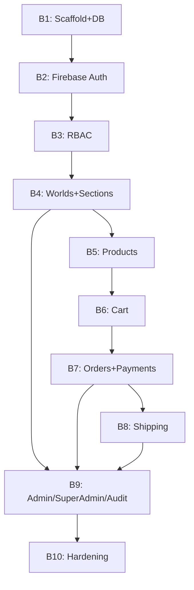

# Yourverse — Backend Implementation Phases (AI Agent Prompts)

This file breaks `backend-architecture.md` into sequential phases, mirroring the structure of `frontend-implementation-phases.md`. Each phase is self-contained: give the agent the **Prompt** block for that phase (plus `backend-architecture.md` as reference context) and it has everything needed to execute correctly, including what NOT to do.

**How to use this file:** paste `backend-architecture.md` into the agent's context once (or point the agent at it in the repo). Run each phase in order — later phases assume earlier module boundaries and guards already exist.

---

## Phase 0 — Shared ground rules (include in every prompt)

```
You are implementing part of "Yourverse," a multi-World e-commerce platform backend.
Read backend-architecture.md fully before writing any code — it is the authoritative
spec. Follow it exactly. In particular, always obey these rules:

1. This is a Modular Monolith. Each Nest module only depends on what another module
   explicitly exports. Never import another module's Prisma model or internal service
   directly — go through its exported service.
2. Products/Cart/Orders/Shipping must never contain World-name branching
   (`if (world.slug === "anime")`). World-specific behavior is expressed only through
   worldId as an opaque foreign key and through WorldSection composition/config —
   never through code paths keyed on a World's identity.
3. Every mutating endpoint must declare authorization explicitly via
   @UseGuards(FirebaseSessionGuard, PermissionsGuard) + @Permissions("x.y") or
   @Roles("SUPER_ADMIN") — never an inline `if (user.role === ...)` check inside a
   controller or service.
4. Never store or persist a Firebase ID token beyond the single verification call
   inside AuthService. Sessions are Firebase session cookies, verified per-request.
5. Money is always Decimal, never a JS number/float, in the schema and in DTOs.
6. Validate every mutating request body with a Zod schema via a ZodValidationPipe —
   nothing reaches a service un-validated.
7. Do not invent new modules or restructure the module list from backend-architecture.md
   §3 without saying so explicitly and why.
8. After writing code for this phase, list the files you created/changed and confirm
   each "Acceptance criteria" item for this phase before ending your turn.
```

---

## Phase B1 — Project Scaffold, Prisma Schema, Database

**Goal:** a running NestJS app connected to PostgreSQL via Prisma, with the full schema from backend-architecture.md §9 migrated, and no business logic yet.

**Prompt:**
```
[Paste Phase 0 block]

PHASE B1: Scaffold the NestJS application and database layer.

Do:
1. Initialize a NestJS + TypeScript project. Add Prisma, configure it against a
   local/dockerized PostgreSQL instance.
2. Create the full folder structure from backend-architecture.md §4 as empty
   module directories (modules/auth, users, worlds, products, categories, cart,
   orders, payments, shipping, admin, super-admin, audit) plus common/
   (guards, decorators, filters, interceptors, pipes) and prisma/.
3. Write the complete Prisma schema exactly as specified in backend-architecture.md §9
   (all enums and models: User, World, WorldSection, Category, Product,
   ProductVariant, ProductImage, Inventory, Cart, CartItem, Order, OrderItem,
   Payment, Shipment, AuditLog) and run the initial migration.
4. Build prisma/prisma.service.ts (a PrismaClient wrapped as an injectable,
   global NestJS module) per backend-architecture.md §8.
5. Add a seed script creating: one test World, a couple of Categories, a couple
   of Products with variants/inventory, and one test User — enough for later
   phases to have real data to work against.
6. Add global setup in main.ts: cookie-parser, Helmet, class-transformer/Zod
   pipe registration stub (real pipe body comes with the first DTO in Phase B4),
   URI API versioning (VersioningType.URI, prefix "v1").

Do NOT:
- Write any controller/service business logic yet — this phase is schema +
  scaffolding only.
- Add repository classes — Prisma is called directly per module per §8/§12.

Acceptance criteria:
- `npx prisma migrate dev` succeeds and the schema matches backend-architecture.md §9
  exactly (field-for-field, including indexes and relations).
- The seed script runs and populates the DB with the described test data.
- The app boots with `npm run start:dev` with no controllers beyond a health check.
```

---

## Phase B2 — Firebase Auth: Session Issuance & Verification

**Goal:** implement the full session-cookie flow from backend-architecture.md §6, unblocking the frontend's Phase 2.

**Prompt:**
```
[Paste Phase 0 block]

PHASE B2: Build AuthModule per backend-architecture.md §6.

Do:
1. Add a FirebaseAdminProvider that initializes the Firebase Admin SDK once
   from service-account credentials in env/secret manager.
2. Build AuthService with:
   - verifyIdToken(idToken) — wraps Admin SDK verifyIdToken.
   - createSession(idToken) — verifies the ID token, calls
     createSessionCookie(idToken, { expiresIn: 7 days in ms }), JIT-provisions
     a User row by firebaseUid if one doesn't exist (default role USER), and
     returns the cookie value.
   - verifySessionCookie(cookie) — wraps Admin SDK verifySessionCookie(cookie, true)
     (revocation checking enabled), throws UnauthorizedException on failure.
   - revokeSession(uid) — wraps Admin SDK revokeRefreshTokens(uid).
3. Build AuthController:
   - POST /auth/session — body { idToken }, calls createSession, sets the
     cookie on the response with exactly the attributes in
     backend-architecture.md §6 (HttpOnly, Secure in prod, SameSite=Lax,
     Max-Age=604800, name it e.g. "__session").
   - GET /auth/me — protected by FirebaseSessionGuard, returns the current
     User's { id, email, displayName, role }.
   - POST /auth/logout — protected, calls revokeSession(req.user.firebaseUid),
     clears the cookie.
4. Build common/guards/firebase-session.guard.ts (FirebaseSessionGuard) exactly
   as shown in backend-architecture.md §6: reads the cookie, verifies it via
   AuthService, loads the User by firebaseUid, attaches it to req.user, 401s
   if any step fails.
5. Build common/decorators/current-user.decorator.ts (@CurrentUser()) to pull
   req.user cleanly into controller params.

Do NOT:
- Persist the raw ID token anywhere beyond the verifyIdToken/createSessionCookie
  calls inside AuthService.
- Implement role/permission checks yet — that's Phase B3. FirebaseSessionGuard
  only authenticates, it does not authorize.

Acceptance criteria:
- POST /auth/session with a real Firebase ID token (obtained via a quick manual
  Firebase Auth REST call or the frontend once Phase F2 exists) returns a
  Set-Cookie header with the exact attributes specified, and a matching User
  row now exists in the DB.
- GET /auth/me with that cookie returns the correct user; without it, returns 401.
- POST /auth/logout clears the cookie and revokes it (verify a stale cookie
  now fails verifySessionCookie).
```

---

## Phase B3 — RBAC: Roles, Permissions, Guards

**Goal:** the permission-matrix-behind-guards pattern from backend-architecture.md §6, built before any protected resource module exists.

**Prompt:**
```
[Paste Phase 0 block]

PHASE B3: Build the authorization layer per backend-architecture.md §6.

Do:
1. Create common/authz/permissions.ts with the exact ROLE_PERMISSIONS matrix
   from backend-architecture.md §6 (USER: [], SHIPPING: [...], ADMIN: [...],
   SUPER_ADMIN: ["*"]).
2. Build common/decorators/permissions.decorator.ts (@Permissions(...string[]))
   and common/decorators/roles.decorator.ts (@Roles(...Role[])) using Nest's
   SetMetadata.
3. Build common/guards/permissions.guard.ts (PermissionsGuard): reads required
   permissions from route metadata, checks req.user.role's entry in
   ROLE_PERMISSIONS (SUPER_ADMIN's "*" always passes), 403s otherwise. Design
   the lookup as a single isolated function `hasPermission(role, permission)`
   so swapping this for a DB-backed table later (per backend-architecture.md
   Future Evolution) only touches this one function.
4. Build common/guards/roles.guard.ts (RolesGuard) for the rarer hard-role-gate
   case, per backend-architecture.md §6.
5. Write unit tests for hasPermission() covering every role and at least one
   permission each role should and should not have.

Do NOT:
- Hardcode any permission check inline in a controller — every check must go
  through these guards + decorators, since every later phase depends on this
  being the only authorization mechanism.

Acceptance criteria:
- A protected test route decorated with @UseGuards(FirebaseSessionGuard,
  PermissionsGuard) @Permissions("products.update") correctly 403s a USER-role
  session and 200s an ADMIN-role session.
- SUPER_ADMIN passes every permission check without needing to be listed
  explicitly for each one.
```

---

## Phase B4 — Worlds & Sections Modules

**Goal:** the domain data the entire platform depends on — unblocks frontend Phases F3–F5.

**Prompt:**
```
[Paste Phase 0 block]

PHASE B4: Build WorldsModule and SectionsModule per backend-architecture.md
§7, §11, §26.

Do:
1. WorldsController/Service:
   - GET /worlds/:slug — public, returns the World including its ordered,
     enabled WorldSections nested (this is the exact payload shape the
     frontend's WorldPayload Zod schema in frontend-architecture.md §6 expects
     — match it field for field: id, slug, name, status, direction, locale,
     themeTokens, capabilities, sections[]).
   - POST /worlds — SUPER_ADMIN only (@Roles("SUPER_ADMIN")), creates World
     identity fields only (no sections).
   - PATCH /worlds/:id, DELETE /worlds/:id — SUPER_ADMIN only.
2. SectionsModule (separate module, per backend-architecture.md §3's improvement
   over the initial flat list):
   - GET /worlds/:worldId/sections — used internally by WorldsService to
     assemble the nested payload above.
   - POST /worlds/:worldId/sections — @Permissions("worlds.sections.update"),
     creates a WorldSection with a type/config validated against a
     server-side map of known section types (mirroring, not importing, the
     frontend's sectionSchemas — document this contract clearly in code
     comments since the two are independently declared per
     backend-architecture.md §11).
   - PATCH /worlds/:worldId/sections/reorder — @Permissions("worlds.sections.update"),
     body: array of { id, position }, updates all in one transaction.
   - PATCH /worlds/:worldId/sections/:id — update enabled/config.
   - DELETE /worlds/:worldId/sections/:id.
3. Confirm the permission split: worlds.update (identity, Super Admin territory
   in practice even though technically a permission) vs
   worlds.sections.update (Admin) are genuinely separate checks, not the same
   permission reused.

Do NOT:
- Let WorldSection.config reference product data by storing a denormalized
  copy — only ids/slugs, resolved live by ProductsService later (Phase B5).
- Loosen the reorder endpoint to accept partial position updates without a
  transaction — a half-applied reorder would corrupt composition order.

Acceptance criteria:
- GET /worlds/:slug for the seeded test World (Phase B1) returns a payload
  matching the frontend's expected WorldPayload shape exactly.
- POST /worlds/:worldId/sections with an unrecognized "type" is rejected
  with a clear validation error, not silently accepted.
- The reorder endpoint updates all positions atomically (verify by inspecting
  the transaction or forcing a mid-batch failure in a test).
```

---

## Phase B5 — Products, Categories, Variants, Inventory

**Goal:** the commerce catalog, deliberately World-agnostic beyond the `worldId` foreign key.

**Prompt:**
```
[Paste Phase 0 block]

PHASE B5: Build ProductsModule (+ nested Categories, Variants, Images,
Inventory) per backend-architecture.md §7, §9.

Do:
1. CategoriesController/Service: CRUD scoped to a worldId, self-referencing
   parent/child tree per the schema.
2. ProductsController/Service:
   - GET /worlds/:worldId/products — public, filterable by categoryId, status
     defaults to ACTIVE only for public callers.
   - GET /worlds/:worldId/products/:slug — public, includes variants, images,
     inventory summary.
   - POST /worlds/:worldId/products — @Permissions("products.create"), uses
     the CreateProductSchema DTO exactly as shown in backend-architecture.md §11,
     creates the Product plus its initial variants in one transaction.
   - PATCH/DELETE — @Permissions("products.update" / "products.delete").
3. Implement variant/image/inventory as nested resources or nested DTO fields
   on the product endpoints (your call, but document the choice) — do not
   create a separate top-level /variants collection unless you have a concrete
   reason.
4. Ensure NOTHING in this module ever reads world.slug or branches on it —
   only worldId is used, and only to scope queries.

Do NOT:
- Add any Anime/Chess/etc.-specific fields or logic to Product — if a future
  World genuinely needs a product attribute no other World needs, that belongs
  in ProductVariant.attributes (Json), not a new schema column.

Acceptance criteria:
- Creating a product for the seeded World and fetching it back returns
  correctly nested variants/images/inventory.
- grep this module's source for any World-slug string literal — none should exist.
- A non-ADMIN/SUPER_ADMIN session gets 403 on all mutating product endpoints.
```

---

## Phase B6 — Cart Module

**Goal:** guest + authenticated cart support per backend-architecture.md §7.

**Prompt:**
```
[Paste Phase 0 block]

PHASE B6: Build CartModule per backend-architecture.md §7, §9.

Do:
1. Support both authenticated carts (linked by userId) and guest carts
   (identified by a signed, HttpOnly guestId cookie separate from the auth
   session cookie).
2. Endpoints: GET /cart, POST /cart/items, PATCH /cart/items/:id,
   DELETE /cart/items/:id — resolve the acting cart (guest or user) from
   whichever cookie is present; no @Permissions needed (a cart belongs to
   whoever holds its identifier), but still require FirebaseSessionGuard's
   optional-auth variant or a lightweight "resolve user if present" middleware
   so authenticated users get their persistent cart.
3. On login (called from AuthService.createSession or a follow-up endpoint),
   merge any existing guest cart into the now-known user's cart, deduping
   variant line items by summing quantities.
4. Validate that quantity never exceeds available inventory
   (Inventory.quantity - Inventory.reserved) at the time of add/update,
   returning a clear error otherwise (final enforcement happens again at
   order placement in Phase B7).

Do NOT:
- Require authentication to add to cart — guest carts must work per
  backend-architecture.md §7.
- Let the cart cookie double as the auth session cookie — they are separate
  concerns with separate lifetimes.

Acceptance criteria:
- A guest (no session cookie) can create a cart, add items, and see it
  persist across requests via the guest cookie alone.
- Logging in with an existing guest cart correctly merges it into the
  authenticated user's cart with no duplicate line items.
- Adding a quantity exceeding available inventory is rejected.
```

---

## Phase B7 — Orders & Payments

**Goal:** the critical transactional path — inventory decrement, order creation, payment recording — per backend-architecture.md §7, §19, §20.

**Prompt:**
```
[Paste Phase 0 block]

PHASE B7: Build OrdersModule and PaymentsModule per backend-architecture.md
§7, §9, §19, §20.

Do:
1. POST /orders — requires authentication (FirebaseSessionGuard), requires an
   Idempotency-Key header, and inside a single prisma.$transaction:
   a. Re-validates inventory for every cart line item.
   b. Decrements Inventory.quantity/reserved appropriately.
   c. Creates the Order + OrderItems, denormalizing unitPrice and worldId
      from the live variant/product at this moment (never re-read live price
      after this point).
   d. Clears the cart.
   Store the Idempotency-Key with a snapshot of the response so a retried
   request returns the same result instead of double-creating an order.
2. Build a PaymentProvider interface (per backend-architecture.md §7) with one
   stub/mock implementation for v1 (e.g., "always succeeds") behind it —
   OrdersService/PaymentsService must depend only on the interface, never the
   concrete provider.
3. POST /payments/webhook — also idempotency-key-protected (or provider
   signature + event-id deduped), updates Payment.status and, on success,
   advances Order.status to PAID.
4. GET /orders (own orders, or all orders for @Permissions("orders.read")
   admin/shipping callers, scoped appropriately), GET /orders/:id,
   PATCH /orders/:id (@Permissions("orders.update")).
5. Wire AuditLogService.record(...) calls on order creation and status changes,
   per backend-architecture.md §7/§18.

Do NOT:
- Let OrdersService import a concrete payment SDK directly — only the
  PaymentProvider interface.
- Skip the transaction wrapper "for simplicity" — this is explicitly called
  out as the critical path that must never partially apply.

Acceptance criteria:
- Placing an order decrements inventory, creates the order, and clears the
  cart atomically — force an artificial failure after inventory decrement in
  a test and confirm the whole transaction rolls back (order does not exist,
  inventory is unchanged).
- Sending the same POST /orders request twice with the same Idempotency-Key
  creates only one order.
- An AuditLog row exists for the order creation.
```

---

## Phase B8 — Shipping Module

**Goal:** shipment lifecycle, deliberately decoupled from OrderStatus, per backend-architecture.md §7, §9.

**Prompt:**
```
[Paste Phase 0 block]

PHASE B8: Build ShippingModule per backend-architecture.md §7, §9.

Do:
1. A Shipment is created automatically (status ORDERED) when an Order reaches
   PAID (triggered from OrdersService/PaymentsService via ShippingService's
   exported createForOrder(orderId) method — do not have ShippingModule poll
   or duplicate order logic).
2. GET /shipments — @Permissions("shipping.read") (SHIPPING role has this;
   ADMIN has it too per the matrix).
3. PATCH /shipments/:id — @Permissions("shipping.update"), updates
   trackingNumber/carrier/status through the ShipmentStatus enum
   (ORDERED → PROCESSING → SHIPPED → OUT_FOR_DELIVERY → DELIVERED, or
   CANCELLED from any non-terminal state) — reject invalid transitions
   (e.g., DELIVERED → PROCESSING) with a clear error.
4. Ensure a SHIPPING-role user calling GET /products or GET /users (if they
   somehow guess the URL) is rejected — verify no permission in the SHIPPING
   row of ROLE_PERMISSIONS grants this.

Do NOT:
- Couple ShipmentStatus transitions to OrderStatus beyond the initial
  creation trigger — they are intentionally independent state machines per
  backend-architecture.md §7.

Acceptance criteria:
- A PAID order automatically gets an ORDERED-status Shipment with no manual
  step.
- An invalid status transition (e.g. skipping straight from ORDERED to
  DELIVERED, if you've decided that's invalid — document your chosen
  transition rules) is rejected.
- A SHIPPING-role session gets 403 on /products and /users endpoints.
```

---

## Phase B9 — Admin, Super Admin, Audit Modules

**Goal:** thin orchestration/aggregation layers plus the write-only audit trail, per backend-architecture.md §3, §7, §18.

**Prompt:**
```
[Paste Phase 0 block]

PHASE B9: Build AdminModule, SuperAdminModule, AuditModule per
backend-architecture.md §3, §7, §18.

Do:
1. AuditModule: AuditLogService.record({ actorUserId, action, entityType,
   entityId, metadata }), a global-ish injectable used by Orders (B7),
   Shipping (B8), Worlds/Sections (B4), and SuperAdmin (this phase) — if any
   of those earlier phases didn't call it yet, retrofit those calls now.
   GET /admin/audit-log — @Permissions or @Roles("SUPER_ADMIN"), paginated.
2. AdminModule: aggregation/report endpoints only (e.g., GET /admin/dashboard
   summary counts) — delegate all actual data logic to the existing domain
   services (ProductsService, OrdersService, etc.), do not duplicate queries here.
3. SuperAdminModule:
   - PATCH /super-admin/users/:id/role — @Roles("SUPER_ADMIN"), changes a
     User's role, writes an AuditLog entry.
   - World create/delete already live in WorldsModule (B4) gated by
     @Roles("SUPER_ADMIN") — confirm this, don't duplicate the endpoints here.

Do NOT:
- Put any business logic in AdminService/SuperAdminService beyond
  orchestration/aggregation — per backend-architecture.md §3, real logic
  belongs in the owning domain service regardless of caller.

Acceptance criteria:
- Every mutation across Orders, Shipping, Worlds/Sections, and role changes
  now produces a corresponding AuditLog row.
- GET /admin/audit-log is inaccessible to ADMIN (only SUPER_ADMIN, per your
  chosen gate) — confirm against backend-architecture.md's intent and state
  your decision if the doc left it ambiguous.
```

---

## Phase B10 — API Docs, Rate Limiting, Security Hardening

**Goal:** production-readiness pass per backend-architecture.md §14–17, §21–22.

**Prompt:**
```
[Paste Phase 0 block]

PHASE B10: Hardening pass per backend-architecture.md §14–17, §21–22.

Do:
1. Add @nestjs/throttler with sane per-route limits (tighter on /auth/session
   and /orders than on public GETs), in-memory store for v1 per
   backend-architecture.md §17.
2. Configure CORS exactly as shown in backend-architecture.md §15 (exact
   origin allowlist from env, credentials: true).
3. Add the CSRF mitigation from backend-architecture.md §16: require a custom
   header (e.g. X-Requested-With: yourverse) on all mutating routes via a
   guard/middleware.
4. Wire @nestjs/swagger at /api/docs, gated behind an auth check in production
   (per backend-architecture.md §22), generating docs from the existing Zod-typed
   DTOs (via nestjs-zod or manual @ApiProperty decoration — pick one and note it).
5. Add the global HttpExceptionFilter (backend-architecture.md §13) normalizing
   every error response to { statusCode, code, message } if not already done
   in an earlier phase — confirm every domain exception (ProductNotFoundException,
   etc.) extends the right Nest exception class and carries a stable `code`.
6. Add structured JSON logging with request-id correlation (backend-architecture.md §18).

Do NOT:
- Introduce Redis or BullMQ here — those are explicitly future work
  (backend-architecture.md §23–24), out of scope for v1 hardening.

Acceptance criteria:
- Exceeding the throttle limit on /auth/session returns 429.
- A mutating request missing the custom header is rejected.
- /api/docs renders full, accurate documentation matching every implemented
  endpoint's actual DTO shape.
- Every error response across the API follows the same { statusCode, code,
  message } shape.
```

---

## Quick Reference — Phase Dependencies


