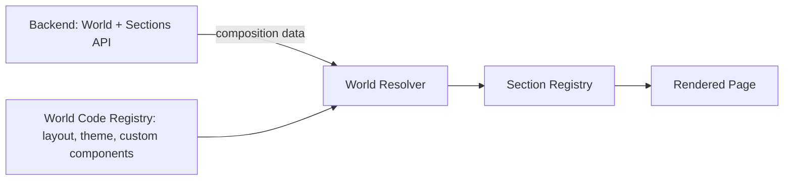
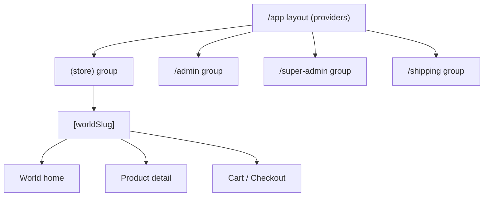
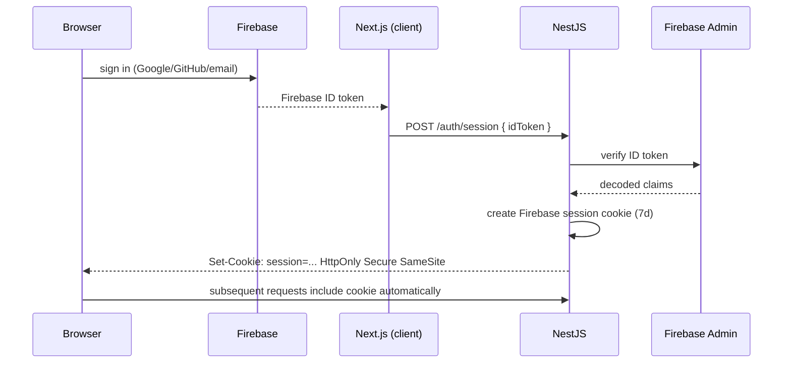

# Yourverse — Frontend Architecture

## 1. Architecture Overview

Yourverse is a single Next.js application serving four surfaces — the multi-World storefront, an Admin dashboard, a Super Admin dashboard, and a Shipping dashboard — from one codebase and one deployment.

The core idea: a **World** is a domain concept, not a theme. A World is composed of an ordered list of **Sections**. Each Section *type* has exactly one implementation (a React component + a Zod schema) living in code, registered once in a **Section Registry**. What varies per World is *which* sections are used, in what order, and with what config values — and that composition is data, fetched from the backend. Code never asks "which World am I in" to decide what to render; it asks "which sections does this World's composition contain" and renders them generically.



Two registries cooperate:

- **World Registry** (code): per-slug metadata that must be code — layout shell, font loading, RTL handling, which custom section components exist for this World.
- **Section Registry** (code): a map from `section.type` (string) to a component + Zod schema. Global, not per-World.

A World's page is built by resolving the World (DB), reading its ordered, enabled sections (DB), and rendering each through the Section Registry. Adding a World means adding a DB row plus (optionally) new section types/components — never editing an `if (world === ...)` chain.

## 2. Architectural Principles

1. **Composition over configuration-as-code.** The backend describes *what* to render (ordered section list + config); the frontend owns *how* to render it.
2. **No World branching in shared logic.** Cart, checkout, product listing, and order flows never inspect `worldSlug` to change behavior. If a World needs unique commerce behavior, it's expressed as a *capability flag* consumed generically, not a name check.
3. **Registries, not conditionals.** Every extension point (World, Section, Payment method later, etc.) is a registry keyed by a string id, resolved via lookup, not a switch/if-chain that grows forever.
4. **Config is data, components are code.** Anything an Admin should edit without a deploy is DB-backed JSON. Anything requiring new visual/interactive behavior is a new component + registry entry, shipped by a developer.
5. **Type safety through the whole pipeline.** Discriminated unions + Zod schemas mean a malformed section config from the API fails validation before it ever reaches a component, and TypeScript narrows `config` correctly inside each section component.
6. **Server-first rendering.** Server Components fetch and own data by default; Client Components exist only where interactivity requires them.

## 3. Next.js Architecture

Next.js App Router, one application, three route groups sharing the same auth/session infrastructure but different layouts and authorization requirements.



## 4. Folder Structure

```
src/
  app/
    (store)/
      [worldSlug]/
        page.tsx                 # World home — renders sections
        products/[productSlug]/page.tsx
        cart/page.tsx
        checkout/page.tsx
      layout.tsx                 # store shell (header/footer, world theme)
    admin/
      layout.tsx
      products/page.tsx
      worlds/[worldId]/sections/page.tsx   # drag-to-reorder sections
      orders/page.tsx
    super-admin/
      layout.tsx
      worlds/page.tsx             # create/delete Worlds
      users/page.tsx              # role management
      audit-log/page.tsx
    shipping/
      layout.tsx
      shipments/page.tsx
    api/
      auth/session/route.ts       # BFF proxy to NestJS session endpoint (if needed)
    layout.tsx                    # root providers
  features/
    auth/
    products/
    cart/
    checkout/
    orders/
    shipping/
    worlds/                       # admin-facing world management UI
  worlds/
    registry/
      index.ts                    # WORLD_REGISTRY
      anime.ts
      tech.ts
      chess.ts
      arabic.ts
      gaming.ts
    sections/
      registry.ts                 # SECTION_REGISTRY
      shared/
        Hero.tsx
        ProductGrid.tsx
        Collection.tsx
        FeatureSection.tsx
        ProductComparison.tsx
      anime/
        CharacterShowcase.tsx
      chess/
        ChessHero.tsx
        ChessBoard.tsx
      tech/
        TechHero.tsx
    types/
      world.types.ts
      section.types.ts
  components/                      # shared, World-agnostic UI (shadcn/ui based)
  lib/
    api/                           # typed API client, one function per endpoint
    auth/                          # firebase client init, session helpers
    query-client.ts
  providers/
    QueryProvider.tsx
    ReduxProvider.tsx
    AuthProvider.tsx
```

## 5. World Architecture

### World data split

| Concern | Lives in | Why |
|---|---|---|
| slug, name, status, locale, direction | PostgreSQL | Admin-editable, no deploy needed |
| theme tokens (colors, radii, spacing scale) | PostgreSQL (JSON), consumed as CSS variables | Cosmetic, safe to be fully dynamic |
| capability flags (`hasCharacterShowcase`, `hasChessBoard`) | PostgreSQL (JSON) | Lets Admin toggle features without a code change to *use* an existing capability |
| section composition (which sections, order, per-instance config) | PostgreSQL (`world_sections`) | This *is* the World's page structure — must be editable without deploys |
| section **implementation** (markup, interaction, animation) | Code (Section Registry) | Requires real UI engineering; not safely expressible as JSON |
| layout shell, font family, RTL wrapper | Code (World Registry) | Structural, rarely changes, benefits from type safety and code review |
| custom, one-off interactive widgets (chess board engine) | Code | Genuinely an application, not configuration |

Rule of thumb: **if changing it should not require a deploy, it's DB. If changing it requires engineering judgment or new interaction logic, it's code.**

### World Registry (code)

```ts
// worlds/registry/index.ts
import type { ComponentType } from "react";

export interface WorldRegistryEntry {
  slug: string;
  Layout: ComponentType<{ children: React.ReactNode }>;
  fontClassName: string;
  direction: "ltr" | "rtl";
}

export const WORLD_REGISTRY: Record<string, WorldRegistryEntry> = {
  anime: { slug: "anime", Layout: AnimeLayout, fontClassName: animeFont.className, direction: "ltr" },
  tech: { slug: "tech", Layout: TechLayout, fontClassName: techFont.className, direction: "ltr" },
  arabic: { slug: "arabic", Layout: ArabicLayout, fontClassName: arabicFont.className, direction: "rtl" },
  chess: { slug: "chess", Layout: ChessLayout, fontClassName: defaultFont.className, direction: "ltr" },
  gaming: { slug: "gaming", Layout: GamingLayout, fontClassName: gamingFont.className, direction: "ltr" },
};

export function getWorldRegistryEntry(slug: string): WorldRegistryEntry {
  return WORLD_REGISTRY[slug] ?? WORLD_REGISTRY["default"];
}
```

If a slug isn't in the registry (a brand-new World an Admin just created in the DB but no developer has styled yet), it falls back to a generic default layout — the World still functions, just with default visuals, until a developer adds a registry entry. This decouples "Admin can create a World" from "engineering has to ship same-day."

### Section Registry

```ts
// worlds/sections/registry.ts
import { z } from "zod";

export const sectionSchemas = {
  hero: z.object({ title: z.string(), subtitle: z.string().optional(), imageUrl: z.string().url() }),
  product_grid: z.object({ title: z.string(), limit: z.number().min(1).max(50), categorySlug: z.string().optional() }),
  character_showcase: z.object({ characterIds: z.array(z.string()) }),
  chess_board: z.object({ mode: z.enum(["preview", "puzzle"]) }),
  feature_section: z.object({ features: z.array(z.object({ title: z.string(), body: z.string(), icon: z.string() })) }),
  product_comparison: z.object({ productIds: z.array(z.string()).min(2).max(4) }),
  collection: z.object({ collectionSlug: z.string() }),
} as const;

export type SectionType = keyof typeof sectionSchemas;

export type SectionConfigMap = { [K in SectionType]: z.infer<typeof sectionSchemas[K]> };

export type SectionConfig = { [K in SectionType]: { type: K; config: SectionConfigMap[K] } }[SectionType];

export const SECTION_COMPONENTS: { [K in SectionType]: React.ComponentType<{ config: SectionConfigMap[K] }> } = {
  hero: Hero,
  product_grid: ProductGrid,
  character_showcase: CharacterShowcase,
  chess_board: ChessBoard,
  feature_section: FeatureSection,
  product_comparison: ProductComparison,
  collection: Collection,
};
```

`SectionConfig` is a discriminated union on `type`. This is the single mechanism that keeps dynamic rendering type-safe — see §17.

## 6. World Configuration Strategy (summary)

The backend returns a World payload shaped like:

```ts
interface WorldPayload {
  id: string;
  slug: string;
  name: string;
  status: "ACTIVE" | "INACTIVE";
  direction: "ltr" | "rtl";
  themeTokens: { colors: Record<string, string>; radius?: string };
  capabilities: Record<string, boolean>;
  sections: Array<{ id: string; type: string; position: number; enabled: boolean; config: unknown }>;
}
```

The frontend never trusts `config: unknown` blindly — every section is validated against its Zod schema at render time (§17). An invalid or unknown section type is skipped and logged, not thrown, so one bad Admin edit doesn't 500 the whole World page.

## 7. Shared Components

`components/` holds World-agnostic building blocks on top of shadcn/ui: `Button`, `Price`, `Rating`, `AddToCartButton`, `QuantityInput`, `Breadcrumbs`, form primitives. These never import from `worlds/`. Any Section component may use them, but they must not encode section- or World-specific assumptions.

## 8. World-Specific Components

Live under `worlds/sections/<world-namespace>/`. They may still be reused by other Worlds if useful (e.g., `ChessBoard` could later be composed into a "Puzzle World"); the namespace reflects origin, not an access restriction. They receive only their typed `config` and shared components/hooks — never `worldSlug` — so they stay portable and testable in isolation.

## 9. Feature Architecture

Each feature folder (`features/products`, `features/cart`, etc.) contains:

```
features/cart/
  api.ts        # typed fetch functions
  hooks.ts      # useCart(), useAddToCart() (TanStack Query)
  slice.ts      # cartUiSlice (Redux) — drawer open/closed only
  types.ts
  components/   # feature-owned UI not tied to a World
```

Features are consumed by both the store routes and, where relevant, admin routes (e.g., `features/orders` is used by both the customer order-history page and the Admin orders table, with different query params/permissions).

## 10. Server Components vs Client Components

- **Default: Server Component.** World resolution, section list fetching, product detail data, initial cart snapshot for SSR — all Server Components. This means World/product data reaches the browser already rendered, and secrets/API base URLs used server-side never leak to the client bundle.
- **Client Components** only for: interactivity (add-to-cart button, quantity steppers, cart drawer, checkout form via React Hook Form, chess board interaction, Redux-connected UI, anything using `useState`/`useEffect`/browser APIs).
- Pattern: a Server Component fetches data and passes serializable props into a thin Client Component that owns interaction. Section components that are purely presentational (Hero, FeatureSection) are Server Components; ones needing interaction (ChessBoard, ProductComparison with a selector) are Client Components, still receiving `config` as a prop from the server-resolved section list.

## 11. State Management

### Redux Toolkit — client/UI state only
- Cart drawer open/closed, mobile nav open/closed
- Checkout wizard step (not checkout data itself)
- Locally-selected currency/locale display preference
- Ephemeral multi-step Admin UI state (e.g., unsaved section reorder before "Save")

### TanStack Query — all server state
- Products, Worlds, categories, orders, inventory, shipments, cart contents, user profile
- Every mutation (add to cart, place order, update shipment status) goes through a `useMutation` that invalidates the relevant query key
- Query keys are namespaced: `["world", slug]`, `["products", worldId, filters]`, `["cart"]`, `["orders", { role, filters }]`

Rationale: Redux was historically used to cache server data, which duplicates what TanStack Query already does better (caching, revalidation, background refetch). Keeping Redux to pure UI state prevents the two systems from fighting over source of truth.

## 12. Authentication Integration (frontend side)



- `lib/auth/firebaseClient.ts` initializes the Firebase client SDK and exposes `signInWithGoogle()`, `signInWithGithub()`, `signInWithEmail()`.
- After Firebase sign-in, the client immediately calls the backend session endpoint (§ backend doc) with the ID token, then discards the ID token — it is never stored.
- `AuthProvider` (Client Component, app root) holds only UI-relevant auth state (`isAuthenticated`, `user` display info) sourced from a `useSession()` TanStack Query hook that calls `/auth/me`. It does **not** independently decide authorization — that's enforced by the backend on every protected call.
- Logout calls `/auth/logout` (revokes the session cookie server-side) then clears the query cache.

## 13. Authorization Integration (frontend side)

The frontend uses role/permission data (returned by `/auth/me`) only for **UX**: hiding nav items, disabling buttons, redirecting away from `/admin` before a wasted round trip. It is explicitly *not* the security boundary — every mutation still hits a NestJS guard that can reject it independently. A `usePermission("orders.update")` hook reads from the cached session and returns a boolean for conditional rendering only.

## 14. Routing

```
/[worldSlug]                     store, public
/[worldSlug]/products/[slug]     store, public
/[worldSlug]/cart, /checkout     store, requires session for order placement (guest cart allowed)
/admin/**                        requires ADMIN or SUPER_ADMIN + relevant permission
/super-admin/**                  requires SUPER_ADMIN
/shipping/**                     requires SHIPPING or ADMIN with shipping.* permission
```

`worldSlug` is resolved once per request in the `(store)/[worldSlug]/layout.tsx` Server Component: fetch World by slug, 404 if missing/inactive, provide World + theme via a `WorldProvider` (Server Component-friendly context populated with static data, not client fetching).

## 15. Middleware

Next.js Edge Middleware:
- Checks **cookie presence only** (not validity — the Firebase Admin SDK cannot run in the Edge runtime) to redirect unauthenticated users away from `/admin`, `/super-admin`, `/shipping` for UX.
- Does not decode or trust the cookie's contents.
- **Every** protected page and API route still performs a real check: Server Components call an authenticated backend endpoint (which 401s/403s appropriately) and API route handlers proxy to NestJS, which is the actual authorization authority. Middleware is UX-only, exactly as required — it is never the sole security layer.

## 16. API Client Architecture

`lib/api/client.ts` wraps `fetch` with:
- Base URL from env, `credentials: "include"` so the session cookie is sent
- Automatic JSON parsing + typed error normalization (`ApiError { status, code, message }`)
- One thin function per endpoint in `lib/api/*.ts` (e.g., `getWorldBySlug`, `listProducts`, `createOrder`), each with a Zod schema validating the response shape before returning — this is the boundary where "backend contract" becomes "trusted TypeScript type" on the frontend.
- Server Components call these functions directly (server-side fetch); Client Components call them through TanStack Query hooks that wrap the same functions.

## 17. Type-Safe Dynamic Section Rendering

This is the mechanism that satisfies "no hardcoded `if (world === ...)`" while staying type-safe.

```ts
// worlds/sections/render.ts
import { sectionSchemas, SECTION_COMPONENTS, SectionType } from "./registry";

export function renderSection(raw: { type: string; config: unknown; id: string }) {
  if (!(raw.type in sectionSchemas)) {
    console.warn(`Unknown section type "${raw.type}" — skipping`);
    return null;
  }
  const type = raw.type as SectionType;
  const parsed = sectionSchemas[type].safeParse(raw.config);
  if (!parsed.success) {
    console.warn(`Invalid config for section "${type}"`, parsed.error);
    return null;
  }
  const Component = SECTION_COMPONENTS[type];
  return <Component key={raw.id} config={parsed.data as any} />;
}
```

```tsx
// app/(store)/[worldSlug]/page.tsx
export default async function WorldHome({ params }: { params: { worldSlug: string } }) {
  const world = await getWorldBySlug(params.worldSlug); // includes ordered, enabled sections
  return (
    <>
      {world.sections
        .filter(s => s.enabled)
        .sort((a, b) => a.position - b.position)
        .map(renderSection)}
    </>
  );
}
```

No `switch (world.slug)` ever appears. Adding a World is a data operation; adding a Section type is one registry entry.

## 18. How to Add a New World

1. Super Admin creates the World row (slug, name, theme tokens, direction) via `/super-admin/worlds` — it is immediately live with a default layout.
2. Admin composes it: adds `world_sections` rows (reusing existing shared sections like `hero`, `product_grid`) via the drag-and-drop section manager — no code required for a World that only needs existing sections.
3. If the World needs a distinct visual identity, a developer adds a `WorldRegistryEntry` (layout, fonts) — a few hours of work, isolated to one file, no changes to other Worlds.
4. If the World needs a genuinely new interaction (like the chess board), a developer builds a new section component + Zod schema, registers it in `SECTION_COMPONENTS`/`sectionSchemas` — again, additive.

## 19. How to Add a New Section

1. Define its config shape with a Zod schema in `registry.ts`.
2. Build the component under `worlds/sections/shared/` (if reusable) or a World namespace (if bespoke).
3. Register both in `sectionSchemas` and `SECTION_COMPONENTS`.
4. It's now available to any World via `world_sections` composition — no existing World's code changes.

## 20. Example: Adding "Tech World" Product Comparison

```ts
// world_sections row created by Admin:
{ type: "product_comparison", position: 2, enabled: true, config: { productIds: ["p1","p2","p3"] } }
```
No frontend change needed — `product_comparison` was already registered generically and works for any World.

## 21. Forms and Validation

React Hook Form + Zod (`zodResolver`) for every form (checkout address, admin product form, world section config editor). The same Zod schemas that validate section config are reused to build the Admin's section-editing forms, so the "shape a section accepts" is defined exactly once.

## 22. Error Handling

- `ApiError` thrown by the API client is caught at the feature/query level; TanStack Query's `error` state drives inline UI.
- Route-level `error.tsx` boundaries per route group (`(store)/error.tsx`, `admin/error.tsx`) render user-appropriate fallback UI.
- Section rendering failures are isolated per-section (§17) — one broken section never takes down the page.

## 23. Loading States

- `loading.tsx` per route segment for SSR navigation loading.
- TanStack Query `isPending`/`isFetching` drive skeletons for client-fetched data (cart, admin tables).
- Section components accept no separate "loading" prop — since World/section data is fetched server-side before render, sections render complete or not at all; only interactive sub-widgets (e.g., product comparison price refresh) have their own local loading state.

## 24. Caching

- Next.js `fetch` cache/revalidate tags for World and product data (`revalidateTag("world:" + slug)` triggered by an Admin webhook/mutation) so published composition changes appear without a full redeploy.
- TanStack Query's in-memory cache handles client-side revalidation and dedup.
- No Redis dependency on the frontend in v1.

## 25. Performance

- Server Components minimize client JS per World page.
- Images via `next/image` with per-World remote patterns configured for product/media hosting.
- Route-level code splitting is automatic per App Router segment; World-specific bespoke sections (chess engine) are dynamically imported (`next/dynamic`) so other Worlds never pay for Chess World's JS.

## 26. Accessibility

- shadcn/ui primitives (Radix-based) provide accessible interaction patterns by default.
- Section components must supply semantic headings and alt text via their config (e.g., `hero.config` requires `imageUrl` + implied alt from `title` unless overridden).
- Focus management enforced in cart drawer / modals via Radix `Dialog`.

## 27. RTL Strategy

- `direction` is a World property (`ltr`/`rtl`), set on the World's root wrapper (`<div dir={world.direction}>`).
- Tailwind logical properties (`ps-`, `pe-`, `ms-`, `me-`) are used in shared components instead of physical `pl-`/`pr-` so they flip automatically under `dir="rtl"`.
- Arabic World's `WorldRegistryEntry` loads an Arabic-appropriate font and sets `direction: "rtl"`; no other World or shared component needs to know RTL exists.

## 28. Admin Architecture

`app/admin/**` reuses `features/products`, `features/orders`, `features/shipping` hooks (same TanStack Query hooks, different queries/permissions) but has its own presentation components (data tables, forms) — it does **not** reuse store-facing UI components like `ProductGrid` or `Hero`, since admin tables and storefront sections have unrelated visual/interaction requirements. The one exception: the section composition editor renders a live, faithful preview using the *actual* `renderSection` pipeline (§17), so what Admin sees while editing is exactly what customers will see.

## 29. Super Admin Architecture

Adds World create/delete, global user role management, audit log viewing. Structurally identical to Admin (own route group, own pages) but gated by `SUPER_ADMIN` role only; shares `features/worlds` and `features/users` hooks with narrower Admin-facing counterparts where permissions allow overlap (e.g., Admin can *edit* a World's sections but not create/delete the World itself).

## 30. Shipping Dashboard Architecture

Narrow surface: shipment list, status update, tracking number entry. Reuses `features/shipping` and read-only parts of `features/orders`. A SHIPPING-role user never receives product/user data from the API regardless of what the frontend requests — enforced backend-side, not just hidden in the UI.

## 31. Recommended Conventions

- One section type = one Zod schema + one component, colocated in intent even if files are split by World namespace.
- Never import `worlds/registry` into `features/*` — dependency direction is World → Features, never the reverse.
- Query keys always include the World id/slug when the data is World-scoped.
- No component reads `process.env` directly outside `lib/`.

## 32. Anti-Patterns to Avoid

- ❌ `if (worldSlug === "chess") return <ChessBoard />` inside a shared component.
- ❌ Storing full HTML/JSX strings in the database ("generic CMS renderer") — config is data describing *parameters*, never markup.
- ❌ Putting server data (products, orders) into Redux "for consistency."
- ❌ A single giant `world.config` JSON blob containing layout AND components AND business rules — config only ever describes composition and parameters for code that already exists.
- ❌ Trusting the frontend's role/permission check as the actual authorization boundary.

## Implementation Order

1. Scaffold Next.js app, Tailwind, shadcn/ui, base providers (Query, Redux, Auth).
2. Firebase client integration + `/auth/session` call wiring (backend must exist first — build in parallel with backend §Implementation Order step 1–3).
3. Build API client + Zod response validation for `worlds`, `products`.
4. Build Section Registry with 2–3 shared sections (`hero`, `product_grid`) and generic `renderSection`.
5. Build `(store)/[worldSlug]` route resolving one seeded World end-to-end.
6. Add cart (TanStack Query + minimal Redux UI state) and checkout (React Hook Form + Zod).
7. Add remaining shared sections, then one World-specific section (Character Showcase) to validate the extension path.
8. Build Admin product/order tables and the section composition editor (reuse `renderSection` for live preview).
9. Build Super Admin World CRUD and user role management.
10. Build Shipping dashboard.
11. Add remaining Worlds (Chess, Arabic RTL, Gaming) using the now-proven registry pattern.

## Future Evolution

**Stays unchanged as the project grows:** the World → Section composition model, the registry pattern, the Server/Client Component split, TanStack Query as the sole server-state layer.

**Likely to evolve:** the Admin section editor may grow a full visual drag-and-drop builder; Redis-backed revalidation could replace tag-based Next.js caching at scale; a design-tokens pipeline could generate World theme CSS at build time instead of runtime CSS variables if performance demands it; genuinely novel future Worlds (e.g., one needing real-time multiplayer) may require a new section *category* (e.g., WebSocket-backed sections) — the registry pattern accommodates this as an additive change, not a redesign.
