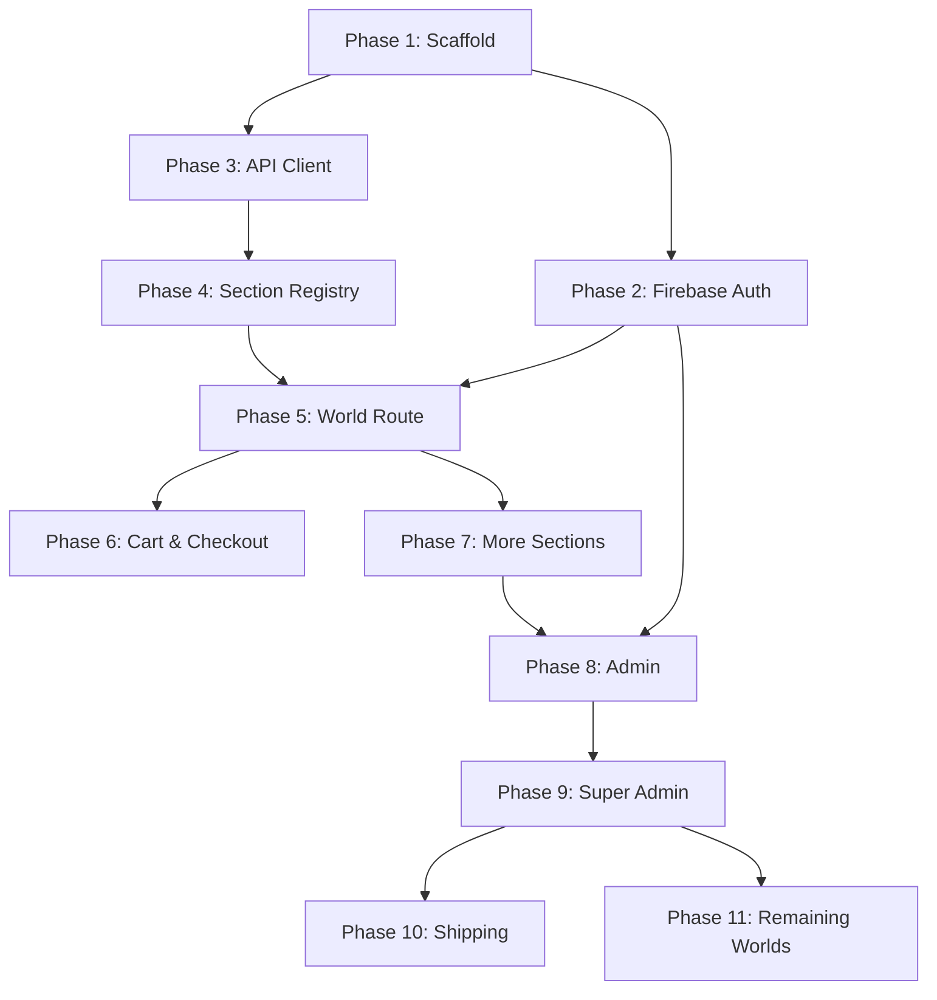

# Yourverse — Frontend Implementation Phases (AI Agent Prompts)

This file breaks `frontend-architecture.md` into sequential phases. Each phase is self-contained: give the agent the **Prompt** block for that phase (plus `frontend-architecture.md` as reference context) and it has everything needed to execute correctly, including what NOT to do.

**How to use this file:** paste `frontend-architecture.md` into the agent's context once at the start of the session (or keep it in the repo and tell the agent to read it first). Then run each phase's prompt in order. Do not skip ahead — later phases assume earlier ones are in place. After each phase, verify against that phase's "Acceptance criteria" before moving on.

---

## Phase 0 — Shared ground rules (include in every prompt)

Paste this block at the top of every phase prompt, before the phase-specific instructions:

```
You are implementing part of "Yourverse," a multi-World e-commerce platform.
Read frontend-architecture.md in this repo/context fully before writing any code — it is
the authoritative spec. Follow it exactly. In particular, always obey these rules:

1. Never write `if (worldSlug === "...")` or any World-name branching in shared code.
   World behavior comes ONLY from: (a) which sections a World's composition includes,
   (b) the WORLD_REGISTRY entry for that slug, (c) capability flags. If you find yourself
   wanting to branch on a World's name, stop and use a registry lookup instead.
2. Section config is DATA. Section rendering is CODE. Never store markup/JSX/HTML strings
   in config. Every section type must have a Zod schema and a registered component.
3. Server Components by default. Only mark a component "use client" when it needs
   interactivity, state, or browser APIs.
4. Server state (products, worlds, orders, cart, inventory, shipments, user profile) goes
   through TanStack Query, never Redux. Redux is ONLY for ephemeral UI state (drawers,
   wizard step, toggles).
5. Every API response is validated with a Zod schema at the boundary in lib/api/ before
   the rest of the app touches it.
6. Do not invent new top-level folders outside the structure in frontend-architecture.md
   §4 without saying so explicitly and why.
7. Write TypeScript strictly — no `any` except the one documented cast inside renderSection.
8. After writing code for this phase, list the files you created/changed and confirm each
   "Acceptance criteria" item for this phase before ending your turn.
```

---

## Phase 1 — Project Scaffold & Core Providers

**Goal:** a running Next.js app with the full folder skeleton and global providers wired, no features yet.

**Prompt:**
```
[Paste Phase 0 block]

PHASE 1: Scaffold the Next.js application.

Do:
1. Initialize a Next.js (App Router) + TypeScript + Tailwind CSS project.
2. Install and configure: Redux Toolkit, TanStack Query, React Hook Form, Zod,
   shadcn/ui (init with a neutral base theme).
3. Create the exact folder structure from frontend-architecture.md §4 as empty
   directories with placeholder index files where needed (features/, worlds/,
   components/, lib/, providers/, and the app/ route groups: (store), admin,
   super-admin, shipping).
4. Build providers/QueryProvider.tsx (TanStack QueryClientProvider with sane
   defaults: staleTime, no refetchOnWindowFocus for now) and providers/ReduxProvider.tsx
   (a Redux store with one placeholder slice, e.g. uiSlice, so the pattern exists).
5. Wire both providers into app/layout.tsx (root layout), Client Component wrapper
   only around the providers themselves, keeping layout.tsx itself a Server Component
   where possible.
6. Add a minimal root page.tsx that just confirms the app boots (can be deleted later).
7. Set up lib/api/client.ts as an empty typed fetch wrapper stub (base URL from env,
   credentials: "include", JSON parsing, ApiError type) — do not implement real
   endpoints yet, that's Phase 3.

Do NOT:
- Build any World, Section, or auth logic yet.
- Add any business feature folders' contents beyond empty placeholders.

Acceptance criteria:
- `npm run dev` boots with no errors.
- Folder structure matches frontend-architecture.md §4.
- Root layout renders children through both QueryProvider and ReduxProvider.
- lib/api/client.ts exports a typed `apiFetch<T>()` function and an `ApiError` class,
  with no real endpoint calls yet.
```

---

## Phase 2 — Firebase Authentication (Client Side)

**Goal:** users can sign in via Google/GitHub/email and a session cookie gets set by calling the backend; frontend auth state is readable via a hook. (Requires backend Phase 2 from `backend-implementation-phases.md`, or a stub `/auth/session` endpoint, to already exist.)

**Prompt:**
```
[Paste Phase 0 block]

PHASE 2: Wire Firebase Authentication on the frontend per frontend-architecture.md §12–13.

Do:
1. Create lib/auth/firebaseClient.ts: initialize the Firebase client SDK from env vars,
   export signInWithGoogle(), signInWithGithub(), signInWithEmail(email, password),
   and signOutFirebase().
2. After any successful Firebase sign-in, immediately call
   POST {API_BASE}/api/v1/auth/session with { idToken } using credentials: "include"
   (via lib/api/client.ts), then discard the idToken — never store it in state,
   localStorage, or Redux.
3. Add lib/api/auth.ts with typed functions: createSession(idToken), getMe(), logout(),
   each validating the response with a Zod schema.
4. Build features/auth/hooks.ts: useSession() as a TanStack Query hook calling getMe(),
   and useLogout() as a mutation calling logout() then clearing the query cache.
5. Build providers/AuthProvider.tsx (Client Component) that calls useSession() and
   exposes { user, isAuthenticated, isLoading } via context — UI-consumption only,
   NOT an authorization decision point.
6. Build a features/auth/components/SignInForm.tsx (Client Component, React Hook Form +
   Zod for the email/password path) and buttons for Google/GitHub.
7. Wire AuthProvider into app/layout.tsx alongside the Phase 1 providers.

Do NOT:
- Persist the Firebase ID token anywhere.
- Implement any redirect/route-protection logic yet (that's middleware + route guards,
  a later phase) — this phase only proves login works and session state is readable.
- Make any component trust isAuthenticated as a security boundary — it's for UX only.

Acceptance criteria:
- Signing in via any method results in a Set-Cookie response from the backend
  (verify in Network tab) and useSession() reflects the logged-in user afterward.
- Logging out clears the session and useSession() reflects logged-out state.
- No ID token appears in Redux devtools, localStorage, or component state after
  the initial sign-in call.
```

---

## Phase 3 — Typed API Client & World/Product Fetching

**Goal:** a real, Zod-validated API client for Worlds and Products, ready for the World page to consume.

**Prompt:**
```
[Paste Phase 0 block]

PHASE 3: Build the typed API client per frontend-architecture.md §16.

Do:
1. Define Zod response schemas for the World payload exactly as shown in
   frontend-architecture.md §6 (WorldPayload, including nested sections array)
   and for a Product list/detail shape consistent with backend-architecture.md §9.
2. Add lib/api/worlds.ts: getWorldBySlug(slug) — GET /api/v1/worlds/:slug,
   validates response against the World Zod schema, throws ApiError on failure
   or 404.
3. Add lib/api/products.ts: listProducts(worldId, filters), getProductBySlug(worldId, slug),
   each Zod-validated.
4. Add features/products/hooks.ts wrapping these in TanStack Query hooks
   (useWorld(slug), useProducts(worldId, filters), useProduct(worldId, slug))
   with query keys namespaced as described in frontend-architecture.md §11
   (["world", slug], ["products", worldId, filters]).
5. Write a quick test page or story that calls useWorld() for a hardcoded slug
   and prints the raw validated object, to confirm the pipeline end-to-end
   against the real (or stubbed) backend.

Do NOT:
- Build any UI for rendering sections yet — that's Phase 4.
- Add World-name-specific logic anywhere in this client code; it must work
  identically regardless of which slug is requested.

Acceptance criteria:
- Requesting a valid slug returns a fully-typed, Zod-parsed World object with
  no `any` in its type.
- Requesting an invalid/inactive slug surfaces a typed ApiError, not a crash.
- TanStack Query devtools show correctly namespaced cache entries.
```

---

## Phase 4 — Section Registry & Generic Rendering Pipeline

**Goal:** the core mechanism of the whole platform — implement exactly as specified in frontend-architecture.md §5, §17, with 2–3 shared sections working end to end.

**Prompt:**
```
[Paste Phase 0 block]

PHASE 4: Build the Section Registry and generic renderSection pipeline.
This is the most architecturally important phase — follow frontend-architecture.md
§5 and §17 exactly, do not simplify it into a switch/if-chain.

Do:
1. Create worlds/sections/registry.ts implementing:
   - sectionSchemas: a Zod schema per section type, starting with "hero" and
     "product_grid" (exact shapes as in frontend-architecture.md §5).
   - SectionType, SectionConfigMap, SectionConfig discriminated union types,
     derived from sectionSchemas via z.infer — do not hand-write a parallel
     type that could drift from the schemas.
   - SECTION_COMPONENTS: a Record mapping each SectionType to its component.
2. Build worlds/sections/shared/Hero.tsx and ProductGrid.tsx as Server Components
   (ProductGrid may fetch products server-side using Phase 3's API functions
   directly, not the React Query hook, since it runs on the server).
3. Create worlds/sections/render.ts implementing renderSection(raw) exactly as
   in frontend-architecture.md §17: validates raw.type against sectionSchemas,
   safeParse's the config, logs and returns null on any failure (never throws),
   looks up the component in SECTION_COMPONENTS, renders it.
4. Write a unit test for renderSection covering: valid section renders, unknown
   type returns null + warns, invalid config returns null + warns, and confirm
   ONE bad section does not affect others when mapped over an array.

Do NOT:
- Let renderSection throw on bad data — a broken Admin edit must never crash
  the page for customers.
- Add a "type" field check via if/else chain instead of an object lookup —
  use the SECTION_COMPONENTS map.
- Import worlds/sections/registry.ts from anywhere in features/ (dependency
  direction is one-way: pages/worlds import features, not the reverse).

Acceptance criteria:
- A hardcoded array of section objects (one valid "hero", one valid "product_grid",
  one with an unknown type, one with invalid config) rendered through
  `raw.map(renderSection)` produces exactly two rendered sections and two
  console warnings, with no crash.
- Adding a hypothetical third section type requires touching ONLY registry.ts
  and one new component file — prove this by actually adding a trivial third
  type (e.g., "collection") and confirming no other file needed changes.
```

---

## Phase 5 — World Route & Live World Page

**Goal:** `/[worldSlug]` renders a real World end to end using Phases 3+4 together.

**Prompt:**
```
[Paste Phase 0 block]

PHASE 5: Build the (store)/[worldSlug] route per frontend-architecture.md §14, §17.

Do:
1. Build app/(store)/[worldSlug]/layout.tsx (Server Component): fetch the World
   via getWorldBySlug (Phase 3), call notFound() if missing or status !== "ACTIVE",
   look up worlds/registry's WORLD_REGISTRY entry for the slug (fall back to a
   "default" entry if none exists, per frontend-architecture.md §5), and render
   that World's Layout wrapper with a `dir={world.direction}` root element and
   CSS variables derived from world.themeTokens.
2. Build worlds/registry/index.ts with the WORLD_REGISTRY object and at least
   one real entry plus a "default" fallback entry (generic layout, ltr, default font).
3. Build app/(store)/[worldSlug]/page.tsx (Server Component): fetch the World's
   sections (already included in the World payload from Phase 3), filter by
   `enabled`, sort by `position`, and map through renderSection from Phase 4.
4. Add loading.tsx and error.tsx for this route segment per frontend-architecture.md §22–23.

Do NOT:
- Special-case any slug inside layout.tsx or page.tsx — the only per-World
  branching allowed is the WORLD_REGISTRY lookup itself.
- Fetch sections separately from the World payload if the API already nests them
  (only split the calls if backend-architecture.md's actual endpoint shape requires it —
  check before assuming).

Acceptance criteria:
- Visiting /<seeded-world-slug> renders that World's sections in the correct
  order, with the correct layout/fonts from its registry entry.
- Visiting a nonexistent or inactive slug renders a proper 404, not a crash.
- Visiting a slug that exists in the DB but has NO WORLD_REGISTRY code entry
  still renders correctly using the default fallback (prove this with a
  temporary test World).
```

---

## Phase 6 — Cart & Checkout

**Goal:** add-to-cart, cart drawer, and a checkout form, matching the Redux/TanStack Query split in frontend-architecture.md §11.

**Prompt:**
```
[Paste Phase 0 block]

PHASE 6: Build Cart and Checkout per frontend-architecture.md §11, §21.

Do:
1. features/cart/api.ts + hooks.ts: useCart() (TanStack Query, server truth),
   useAddToCart(), useUpdateCartItem(), useRemoveCartItem() (mutations that
   invalidate ["cart"]).
2. features/cart/slice.ts: a Redux slice holding ONLY { isDrawerOpen: boolean }
   and its toggle action. Nothing else about the cart lives in Redux.
3. components/AddToCartButton.tsx and a CartDrawer Client Component reading
   cart contents from useCart() and drawer visibility from the Redux slice.
4. app/(store)/[worldSlug]/checkout/page.tsx: a React Hook Form + Zod form for
   shipping address and payment placeholder, calling a createOrder mutation
   from features/checkout on submit.
5. Ensure a guest (not logged in) can still add to cart (per
   backend-architecture.md §7's guest cart support) and is prompted to
   authenticate only at the final order-placement step if that's the chosen
   product flow — confirm this against backend-architecture.md before deciding,
   and state your assumption if the doc is ambiguous.

Do NOT:
- Put cart line items, totals, or product data into Redux.
- Build a custom payment UI beyond a placeholder — Payments provider
  integration is a backend concern per backend-architecture.md §Payments;
  the frontend only needs a form that submits to the order-creation endpoint.

Acceptance criteria:
- Adding an item updates the cart badge/drawer without a full page reload,
  purely via TanStack Query cache invalidation.
- Opening/closing the drawer does not trigger any network request (proves
  it's pure Redux UI state).
- Submitting checkout with invalid data shows Zod-driven inline validation
  errors before any network call.
```

---

## Phase 7 — Remaining Shared Sections + One World-Specific Section

**Goal:** prove the extension path works by adding real breadth: more shared section types, plus one genuinely custom section (e.g., Character Showcase for Anime World).

**Prompt:**
```
[Paste Phase 0 block]

PHASE 7: Extend the Section Registry per frontend-architecture.md §5, §18–20.

Do:
1. Add shared sections: feature_section, product_comparison, collection —
   each with its Zod schema (frontend-architecture.md §5 shows the shapes)
   and component under worlds/sections/shared/.
2. Add ONE World-specific section: character_showcase under
   worlds/sections/anime/CharacterShowcase.tsx, registered in the same
   registry.ts as any other section — it must NOT be treated specially by
   renderSection; the only thing that makes it "Anime's" is which World's
   composition includes it in the database.
3. If character_showcase needs interactivity (e.g., a carousel), mark only
   that component "use client," per frontend-architecture.md §10.
4. Update the test World's composition (via the admin API or a seed script)
   to include at least one of each new section type, and confirm the
   [worldSlug] page from Phase 5 renders all of them correctly with zero
   changes to page.tsx, layout.tsx, or render.ts.

Do NOT:
- Add any check like `if (section.type === "character_showcase" && worldSlug !== "anime")`
  anywhere — nothing prevents a different World from using this section later;
  that's a feature of the architecture, not a bug to guard against.

Acceptance criteria:
- All new section types render correctly via the existing, unmodified
  renderSection pipeline.
- grep the codebase for the string "anime" outside worlds/registry/anime.ts
  and worlds/sections/anime/* — it should not appear in any shared file
  (page.tsx, render.ts, registry.ts's renderSection logic, etc.).
```

---

## Phase 8 — Admin Dashboard (Products, Orders, Section Composition Editor)

**Goal:** `/admin` with product/order management and the live section-reordering editor described in frontend-architecture.md §28.

**Prompt:**
```
[Paste Phase 0 block]

PHASE 8: Build the Admin dashboard per frontend-architecture.md §14, §28.

Do:
1. app/admin/layout.tsx: gate on isAuthenticated + role/permission from
   useSession() for UX (redirect if clearly unauthorized), but remember this
   is NOT the real security boundary — the backend enforces it regardless.
2. app/admin/products/page.tsx: a data table (own admin-specific component,
   NOT reusing storefront ProductGrid) listing products with create/edit/delete,
   using features/products hooks with admin-scoped queries/mutations and
   React Hook Form + Zod for the product form.
3. app/admin/orders/page.tsx: similar pattern for orders (read + status update).
4. app/admin/worlds/[worldId]/sections/page.tsx: the section composition editor.
   It must:
   a. List the World's current sections with drag-to-reorder (any accessible
      drag-and-drop lib is fine) updating `position` via a mutation to the
      backend's reorder endpoint.
   b. Let the Admin toggle `enabled` and edit `config` for a section using a
      form generated from that section's actual Zod schema (reuse
      worlds/sections/registry.ts's sectionSchemas — do not hand-roll a
      second definition of what fields each section type needs).
   c. Render a live preview panel using the SAME renderSection function from
      Phase 4 — not a separate preview implementation — so what Admin sees
      is exactly what customers will see.

Do NOT:
- Reuse storefront components (Hero, ProductGrid-the-storefront-version) for
  admin tables — admin UI is a separate, purpose-built set of components per
  frontend-architecture.md §28.
- Build a second, parallel section-config-validation system for the editor
  forms — derive them from the existing sectionSchemas.

Acceptance criteria:
- Reordering sections in the editor persists and is reflected next time the
  actual [worldSlug] storefront page is loaded.
- Editing a section's config through a schema-derived form and saving it
  updates the live preview using the real renderSection pipeline.
- An invalid config value is rejected by the form before it ever reaches
  the API call.
```

---

## Phase 9 — Super Admin Dashboard

**Goal:** World lifecycle management and user role administration, per frontend-architecture.md §29.

**Prompt:**
```
[Paste Phase 0 block]

PHASE 9: Build the Super Admin dashboard per frontend-architecture.md §29.

Do:
1. app/super-admin/layout.tsx gated (UX-level) to SUPER_ADMIN only.
2. app/super-admin/worlds/page.tsx: create/delete Worlds (identity fields only —
   slug, name, themeTokens, direction, locale, capabilities) via
   features/worlds hooks distinct from Admin's section-composition hooks
   (identity vs. composition permission split per backend-architecture.md §6).
3. app/super-admin/users/page.tsx: list users, change role via a select bound
   to the backend's role-update endpoint.
4. app/super-admin/audit-log/page.tsx: read-only, paginated table over the
   backend's audit log endpoint.

Do NOT:
- Let Super Admin's World-create form touch `world_sections` directly — that's
  Admin's composition editor from Phase 8; creating a World here should leave
  it with zero or default sections until Admin composes it.

Acceptance criteria:
- Creating a new World here makes it immediately resolvable at /<new-slug>
  (falling back to the default WORLD_REGISTRY layout, per Phase 5's
  acceptance criteria) with no code deploy.
- A non-SUPER_ADMIN user hitting these routes directly (typed URL) is
  redirected client-side AND still rejected by the backend if they bypass
  the UI (verify by calling the API directly, e.g. via curl, as a lower-role user).
```

---

## Phase 10 — Shipping Dashboard

**Goal:** the narrow, role-restricted shipping surface, per frontend-architecture.md §30.

**Prompt:**
```
[Paste Phase 0 block]

PHASE 10: Build the Shipping dashboard per frontend-architecture.md §30.

Do:
1. app/shipping/layout.tsx gated (UX-level) to SHIPPING or ADMIN-with-shipping-permission.
2. app/shipping/shipments/page.tsx: list shipments (read-only order context +
   editable tracking number/carrier/status) via features/shipping hooks.
3. Confirm this dashboard never requests or displays full product or user PII
   data beyond what's needed for a shipping label (name/address, not email/role/etc.)
   — check the actual API response shape and don't request more fields than needed.

Acceptance criteria:
- A SHIPPING-role user can update a shipment's status and it's reflected
  immediately (TanStack Query invalidation).
- Calling the underlying products or users endpoints directly as a SHIPPING
  user (e.g., via curl with their session cookie) is rejected by the backend
  — this is a backend guarantee, but verify it here since this dashboard's
  entire design assumes it.
```

---

## Phase 11 — Remaining Worlds (Chess, Arabic RTL, Gaming)

**Goal:** prove the architecture scales past the first World by adding the rest, including the RTL case.

**Prompt:**
```
[Paste Phase 0 block]

PHASE 11: Add Chess World, Arabic World, and Gaming World per
frontend-architecture.md §18, §27.

Do:
1. For each World: create it via Super Admin (Phase 9), compose it via Admin
   (Phase 8) using existing shared sections wherever sufficient.
2. Chess World: build chess_hero and chess_board section types/components
   (chess_board may be a genuinely interactive Client Component; a real chess
   engine/library integration is acceptable here) and add a WORLD_REGISTRY
   entry if a distinct layout is warranted.
3. Arabic World: set direction: "rtl" on the World record, add a
   WORLD_REGISTRY entry with an Arabic-appropriate font and
   direction: "rtl". Audit worlds/sections/shared components for any
   physical `pl-`/`pr-`/`ml-`/`mr-` Tailwind classes and convert them to
   logical properties (`ps-`, `pe-`, `ms-`, `me-`) per frontend-architecture.md §27
   so they flip correctly.
4. Gaming World: compose from shared sections plus any gaming-specific
   section your product scope actually requires (do not build speculative
   sections with no real content need).

Do NOT:
- Duplicate the storefront route/page logic per World — all three must run
  through the exact same [worldSlug]/layout.tsx and page.tsx from Phase 5.

Acceptance criteria:
- All three Worlds render correctly at their own slugs using the unmodified
  Phase 5 route.
- Arabic World visibly renders right-to-left with correctly mirrored spacing
  in at least one shared component that uses logical properties.
- Total diff for this phase touches: WORLD_REGISTRY entries, new section
  files, and Tailwind class fixes in shared components — NOT page.tsx,
  layout.tsx, or render.ts.
```

---

## Quick Reference — Phase Dependencies


