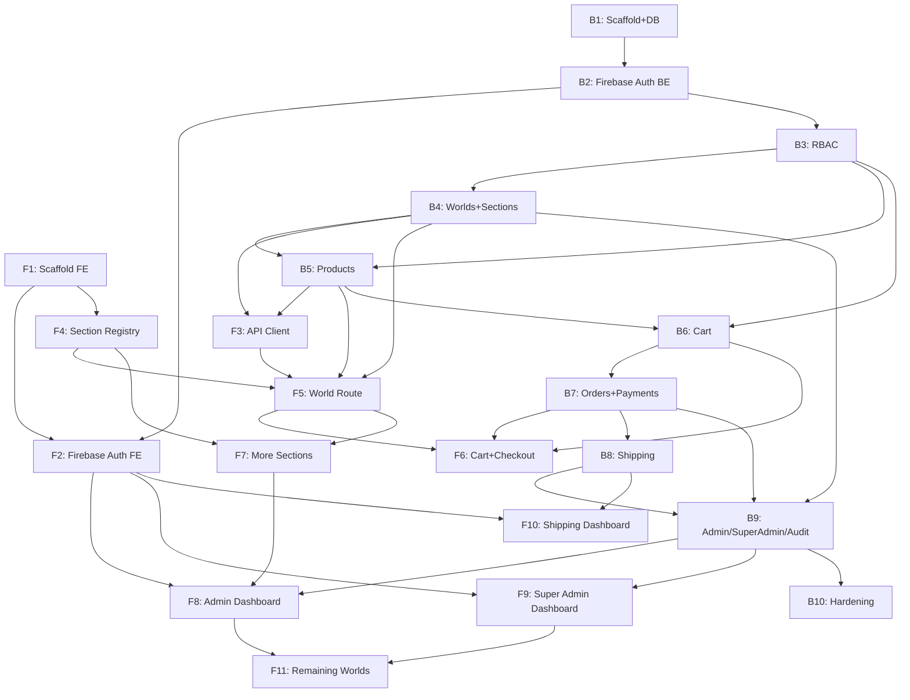

# Yourverse — Master Implementation Plan (Backend + Frontend, In Execution Order)

This file is the single execution roadmap for Yourverse. It interleaves every phase from `backend-implementation-phases.md` (labeled **B**) and `frontend-implementation-phases.md` (labeled **F**) into the actual order they should be executed, based on real dependencies (an endpoint must exist before the frontend can call it; a guard must exist before a protected module is built on top of it, etc.).

**How to use this file:**
1. Keep `backend-architecture.md`, `frontend-architecture.md`, `backend-implementation-phases.md`, and `frontend-implementation-phases.md` all available to whoever/whatever is executing (developer or AI agent).
2. Execute the **Global Steps** below strictly in order — do not start a step whose "Depends on" list isn't fully done.
3. For the actual prompt text of each step, open the referenced phase in its source file (`Bx` → `backend-implementation-phases.md`, `Fx` → `frontend-implementation-phases.md`) and use that phase's **Prompt** block verbatim (it already includes the shared ground-rules block for its track).
4. Steps marked **(parallel-safe)** have no dependency on each other and can be done in either order, or by two people/agents at once, as long as both finish before the next step that depends on them.

---

## Global Execution Order

| # | Step | Track | Depends on | What it unlocks |
|---|------|-------|-----------|-----------------|
| 1 | **B1** — Scaffold, Prisma schema, DB, seed data | Backend | — | Everything backend |
| 1 | **F1** — Next.js scaffold, providers, folder skeleton *(parallel-safe with B1)* | Frontend | — | Everything frontend |
| 2 | **B2** — Firebase Auth: session issuance/verification | Backend | B1 | Real login flow |
| 3 | **F2** — Firebase Auth (client): sign-in + session hook | Frontend | F1, B2 | Authenticated UI state |
| 4 | **B3** — RBAC: roles, permissions, guards | Backend | B2 | Every protected endpoint from here on |
| 5 | **B4** — Worlds + Sections modules | Backend | B3 | The World page, Admin composition editor |
| 6 | **B5** — Products, Categories, Variants, Inventory | Backend | B3 (uses same guards); logically after B4 | Product data for storefront and cart |
| 7 | **F3** — Typed API client: Worlds + Products | Frontend | F1, B4, B5 | Real data for the World route |
| 8 | **F4** — Section Registry + generic `renderSection` | Frontend | F1 (only needs the shapes agreed in B4/F3, no live call required) | The core rendering mechanism |
| 9 | **F5** — `[worldSlug]` route: live World page | Frontend | F3, F4, B4, B5 | The first working storefront page |
| 10 | **B6** — Cart module (guest + authenticated) | Backend | B3, B5 | Add-to-cart |
| 11 | **B7** — Orders + Payments (transactional core) | Backend | B6 | Checkout completion |
| 12 | **F6** — Cart & Checkout (frontend) | Frontend | F5, B6, B7 | End-to-end purchase flow |
| 13 | **F7** — Remaining shared sections + one World-specific section | Frontend | F4, F5 | Proves the extension path; content variety |
| 14 | **B8** — Shipping module | Backend | B7 (Shipment auto-created on PAID order) | Shipment tracking data |
| 15 | **B9** — Admin, Super Admin, Audit modules | Backend | B4, B7, B8 | Every admin-facing endpoint |
| 16 | **F8** — Admin dashboard (products, orders, section editor) | Frontend | F2, F7, B9 | Admin can manage the platform |
| 17 | **F9** — Super Admin dashboard | Frontend | F2, B9 | World lifecycle + role management |
| 18 | **F10** — Shipping dashboard | Frontend | F2, B8 | Shipping team can operate |
| 19 | **B10** — API docs, rate limiting, security hardening | Backend | B9 (all endpoints exist to document/protect) | Production-readiness |
| 20 | **F11** — Remaining Worlds (Chess, Arabic RTL, Gaming) | Frontend | F8 (needs Admin composition editor to compose them), F9 (needs Super Admin to create them) | Full initial World catalog live |

---

## Dependency Graph (both tracks combined)

---

## Notes on Parallelization

If you have two agents/developers (one backend, one frontend) working simultaneously, this is the safe split:

- **Round 1 (parallel):** B1 + F1
- **Round 2 (backend leads):** B2, then B3, then B4 and B5 — frontend is blocked on F2/F3 until B2/B4/B5 land, so frontend can spend this round polishing F1's providers, building shared UI primitives (`components/`), or writing F4 (Section Registry), which has no live backend dependency.
- **Round 3 (parallel again):** F2 + F3 (once B2/B4/B5 are done) while backend starts B6.
- **Round 4:** F5 while backend does B7.
- **Round 5:** F6 + F7 (frontend) while backend does B8 then B9.
- **Round 6:** F8, F9, F10 (frontend, all now unblocked by B9/B8) while backend does B10.
- **Round 7:** F11, using the now-complete Admin/Super Admin tooling.

A single developer/agent working alone should just follow the numbered Global Execution Order top to bottom — it already accounts for the fact that there's no parallel track to exploit.

---

## Checklist Before Moving Between Steps

Before starting step *N+1*, confirm every "Acceptance criteria" item listed in the source phase file for every step in *N*'s "Depends on" column has been verified — not just "the code compiles." Several phases (B7's transaction rollback test, F5's fallback-World-registry test, B4's atomic reorder test) exist specifically to catch mistakes that compile fine but break the architecture's core guarantees.
